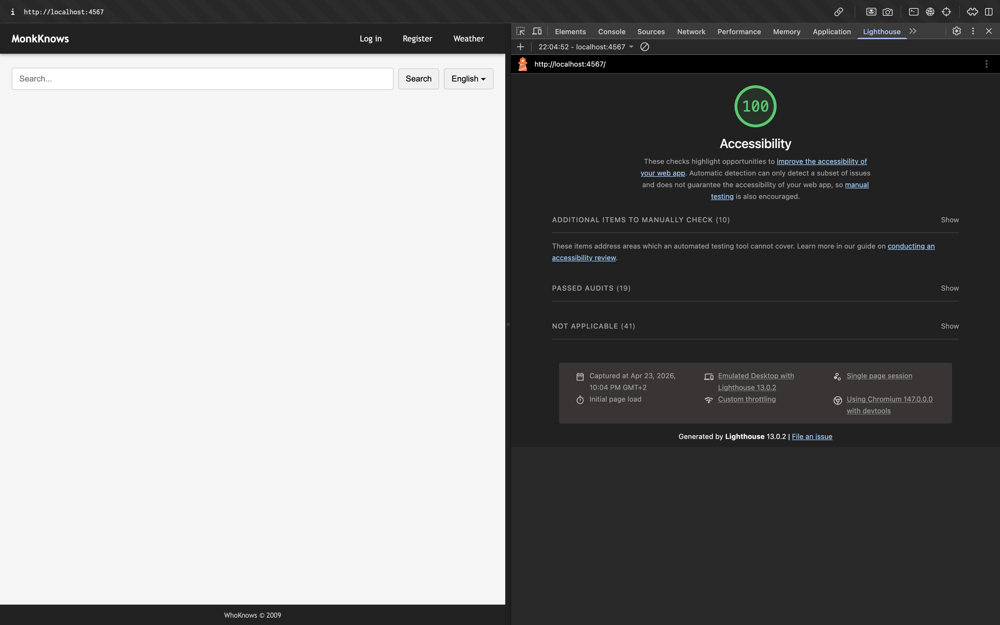

# Choices and Challenges

**Written by:** Andreas, Nima & Sofie
 **Updated:** 1st May 2026

------

## Ruby Version Management

### Context

Ved migration fra Python til Ruby/Sinatra havde teamet behov for at vælge en stabil Ruby version. Der eksisterer forskellige Ruby versioner (3.x.x og 4.x.x), hvor version 4 er nyere men mindre stabil.

### Challenge

- Ruby 4.x.x er nyere men har kompatibilitetsproblemer med Sinatra
- Teammedlemmer havde forskellige Ruby versioner installeret lokalt
- Nogle gems i version 4 ligger paradoksalt under version 3 i versionsnummerering
- Risiko for inkonsistens mellem udviklingsmiljøer

### Choice

**Beslutning:** Standardisere på Ruby 3.x.x for alle teammedlemmer

**Hvordan valget blev truffet:**

- Prioriterede stabilitet over nyeste features
- Sinatra kompatibilitet var afgørende
- Konsistens mellem udviklingsmiljøer var kritisk

**Fordele:**

- Stabil platform med god Sinatra support
- Alle teammedlemmer kører samme version
- Forudsigeligt gem dependency management

**Ulemper:**

- Går glip af nyeste Ruby 4 features
- Fremtidig migration til Ruby 4 bliver nødvendig

**Læring:**

- Versionsstyring skal aftales tidligt i projektet
- Stabilitet > nyeste version ved framework dependencies
- Inkrementelle upgrades er bedre end store spring (som med Python migration)

------

## .gitignore Conflicts

### Context

Ved oprettelse af Ruby-projektet blev der automatisk genereret en `.gitignore` fil i `ruby-sinatra/` mappen. Dette skabte konflikt med den eksisterende `.gitignore` fra legacy projektet.

### Challenge

- To `.gitignore` filer (root og `ruby-sinatra/`) kunne ikke sameksistere
- Filer blev tracked forskelligt afhængig af hvilken `.gitignore` der havde forrang
- Merge conflicts opstod konstant mellem branches
- Forsøg på at oprette tredje `.gitignore` i root løste ikke problemet, da filer allerede var tracked

**Teknisk årsag:** Git tracker filer fra første commit. En ny `.gitignore` stopper ikke tracking af allerede committed filer.

### Choice

**Beslutning:** En enkelt `.gitignore` i repository root

**Proces:**

1. Lukkede alle aktive feature branches
2. Fjernede alle `.gitignore` filer
3. Oprettede ny samlet `.gitignore` i root
4. Untracked tidligere ignorerede filer med `git rm --cached`
5. Committed den nye struktur

**Fordele:**

- Konsistent ignore-logik på tværs af hele projektet
- Ingen merge conflicts fra competing `.gitignore` filer
- Simplere at vedligeholde

**Ulemper:**

- Krævede koordinering (alle branches skulle lukkes)
- Tabte tid på troubleshooting før vi fandt løsningen

**Læring:**

- `.gitignore` hierarki skal planlægges fra start
- Git tracking skal fjernes eksplicit med `git rm --cached`
- Mono repo kræver clear ignore strategy på tværs af sub-projekter

------

## Database File Tracking

### Context

`.db` filer (SQLite databases) blev tracked i Git fra projektets start. Forskellige teammedlemmer havde forskellige versioner af databasen i deres lokale branches.

### Challenge

- Database filer er binære - kan ikke merges som tekst
- Forskellige `.db` versioner på tværs af branches
- Impossible at løse merge conflicts i binære filer
- Tracking af database state skabte konstante conflicts

**Teknisk problem:** Binary files + Git merge = umuligt at reconcile

### Choice

**Beslutning:** Stop tracking af database filer, brug fresh database dumps i stedet

**Implementering:**

1. Tilføjede `.db` patterns til `.gitignore`:

```
   *.db
   *.db-shm
   *.db-wal
```

1. Fjernede alle `.db` filer fra Git history: `git rm --cached *.db`
2. Hentet fresh database dump til lokal udvikling
3. Dokumenterede database setup i README

**Fordele:**

- Ingen database merge conflicts
- Konsistent udviklings-database via dumps
- Mindre repository størrelse

**Ulemper:**

- Kræver setup step for nye udviklere
- Database state er ikke versioneret (men det skal den heller ikke være)

**Læring:**

- Binære filer (databases, builds, logs) hører ikke i Git
- Database schema versioneres via migrations, ikke via `.db` filer
- `.gitignore` skal konfigureres korrekt fra dag 1

------

## OpenAPI Specification Discrepancies

### Context

Vi har modtaget en reference OpenAPI spec fra underviser (Anders Latif) som vi skal efterleve. Samtidig har vi genereret en spec fra den eksisterende Python Flask applikation. Disse to specs er ikke identiske.

### Challenge

- Python-genereret spec har fejl (refererer til HTML responses i stedet for JSON)
- Underviser spec er autoritativ, men Python code har afviget
- Ruby/Sinatra har ingen automatisk spec generation tools (som OpenAPI decorators i Flask)
- Risiko for at porte Python fejl til Ruby implementation

**Eksempel på fejl:**

```python
# Python Flask - forkert response type
@app.route('/api/search')
def search():
    """
    Returns HTML page  # <- FORKERT: Burde være JSON
    """
    return render_template('search.html')
```

### Choice
**Beslutning:** Følg underviser spec som source of truth, brug Python kun som reference

**Implementering:**
- Undermapping mellem underviser spec og faktisk Ruby implementation
- Manuel spec maintenance (ingen auto-generation i Sinatra)
- Docstrings i Ruby bruges til manuel spec generation bagefter

**Proces:**
1. Implementer Ruby endpoint iht. underviser spec
2. Skriv docstring med endpoint beskrivelse
3. Test endpoint matcher spec (Postman/curl)
4. Opdater manuel spec hvis nødvendigt

**Fordele:**
- Correct API contracts fra start
- Ingen Python fejl portes til Ruby
- Lærer API design ved at følge spec nøje

**Ulemper:**
- Mere manuelt arbejde (ingen auto-generation)
- Sinatra mangler Flask-lignende spec decorators
- Kræver disciplin at holde spec synced med kode

**Retrospektiv:**
- Python spec kunne kun bruges til at *identificere* fejl, ikke som template
- Nima opdagede at korrekt workflow er: Skriv kode → Generer spec (ikke omvendt)
- Vi havde allerede skrevet Ruby kode baseret på Python - måtte tilbage og justere

**Læring:**
- OpenAPI spec skal være source of truth INDEN implementering
- Auto-generation tools er ikke altid tilgængelige (framework dependent)
- 1:1 porting mellem frameworks (Python→Ruby) kan kopiere fejl

------

## Programming Language Choice

### Context
Kursusbegrænsninger: Ikke Java, Python eller Node.js. Teamet skulle vælge et nyt sprog til rewrite af Flask applikationen.

### Challenge
- Ingen teammedlemmer havde Ruby erfaring
- Behov for microframework (ligesom Flask)
- Måtte balancere læringskurve vs. dokumentation tilgængelighed

**Overvejede alternativer:**
- **Go:** Performant, men meget forskellig fra OOP baggrund
- **PHP:** Outdated, mindre relevant for moderne DevOps
- **Ruby:** Læselig syntaks, stærk web framework økosystem

### Choice
**Beslutning:** Ruby + Sinatra framework

**Rationale:**
- Sinatra er lightweight microframework (direkte Flask analog)
- Ruby syntaks er læselig og begyndervenlig
- Omfattende dokumentation og community support
- Aktiv udvikling og vedligeholdelse

**Fordele (forudset):**
- Minder om Python i læsbarhed
- Sinatra er mindre kompleks end Rails
- God match til DevOps værktøjskæde

**Ulemper (forudset):**
- Læringskurve for helt nyt sprog
- Mindre udbredt i industrien end Node.js/Python
- Manglende auto-generation tools for specs

**Retrospektiv:**
- Ruby syntaks var faktisk hurtig at lære
- Sinatra simplicity var en fordel, men mangler conventions (se arkitektur valg)
- Havde vi vidst at spec auto-generation manglede, havde det måske påvirket valget

**Læring:**
- Framework økosystem er lige så vigtigt som sproget selv
- Microframework flexibility kræver mere manual opsætning

------

## Architecture Pattern Choice

### Context
Sinatra har ingen indbyggede conventions for projekt struktur (modsat Rails MVC convention-over-configuration). Teamet skulle selv definere arkitektur.

### Challenge
- Sinatra er meget barebones - ingen folder structure enforced
- Teamet kender MVC fra Spring Boot (Java)
- Behov for at balancere simplicity vs. organization

**Overvejede patterns:**
- **MVC (Model-View-Controller):** Kendt fra Spring Boot
- **Flat structure:** Alt i én fil (`app.rb`)
- **Service layer pattern:** Separate business logic

### Choice
**Beslutning:** MVC-inspireret struktur, men "så lavt niveau som muligt"

**Implementering:**

```markdown
ruby-sinatra/
├── app.rb              # Routes & controllers (direkte kode)
├── models/             # Database models
├── views/              # Templates (hvis nødvendigt)
└── public/             # Static assets
```

**Rationale:**

- MVC giver struktur teamet kender
- "Lavt niveau" = minimal abstraction, flækker kode direkte i `app.rb`
- Sinatra's flexibility tillader gradvis strukturering

**Fordele:**

- Kendt pattern fra Spring Boot
- Kan starte simpelt og refaktorere senere
- Tydelig separation mellem routes og models

**Ulemper:**

- Ingen Sinatra conventions at følge (må opfinde selv)
- Risiko for at `app.rb` bliver for stor
- "Lavt niveau" kan betyde mindre modular kode

**Retrospektiv:** (Opdateres løbende)

**Læring:**

- Microframeworks giver frihed, men kræver disciplin
- MVC kan tilpasses selv når framework ikke enforcer det
- Start simple, refaktorer når smertepunkter opstår

------

## Initial Deployment Strategy - week 3

### Context
- Vi skulle deploye første gang i uge 3 på Azure.
- Ingen CI endnu (kommer uge 4), Docker/CD kommer senere (uge 5–6).
- Skolens rettigheder krævede VM-oprettelse via scripts (ikke Azure Portal UI).
- Krav: statisk public IP (skal whitelist’es til simulation/underviser)

### Challenge
- Azure policies/regions var begrænsede → ikke alle regioner virkede.
- VM fik ikke automatisk “stabil” IP i vores første forsøg.
- Ruby-version mismatch på Ubuntu (3.0.2) vs projektets Ruby (3.2.3) → bundler mismatch.
- SQLite er en fil → skulle placeres korrekt + skrive-rettigheder (WAL/SHM).
- App skulle køre stabilt efter logout → krævede service management (systemd).
- Port-regler/NSG priority konflikter (22 vs 80).

**Overvejede alternativer:**
- SCP upload + manual restart (simpelt, men ikke reproducérbart)
- SSH + git pull + manual restart (simpelt, men drift “dør” ved logout uden service)
- Cron sync + auto restart (for meget “CD” nu)
- Build/CI/CD (for tidligt ift. kursusplan)

### Choice
**Beslutning:** Azure VM + manuel deploy via SSH + git clone/pull, med systemd til drift og Nginx som reverse proxy. Statisk public IP via Azure CLI.

**Implementering:**

```markdown
1) Opret VM via lærerens scripts (Azure CLI) + Static Public IP
2) SSH ind + apt update/full-upgrade + reboot
3) Installer Ruby 3.2.3 via rbenv (match dev) + bundler 4.0.6
4) Standard layout: /opt/whoknows/app (kode) + /opt/whoknows/data (db)
5) git clone repo → bundle install
6) Upload SQLite db med scp → styr sti via DB_PATH env-var
7) systemd service: starter app på 127.0.0.1:4567 og overlever reboot/logout
8) Nginx proxy: port 80 → 127.0.0.1:4567
9) Åbn port 80 i Azure NSG med unik priority (Azure CLI kommando)
10) Test i browser + curl mod /api/search
```

**Rationale:**
- Minimal løsning nu, men “klar til næste step”: systemd + Nginx passer direkte ind når vi senere Dockeriserer (bytter bare ExecStart/container).
- Reproducerbar drift uden CI/CD.
- Sikkerhed: app lytter kun på localhost; kun Nginx eksponeres på 80.

**Fordele:**
- Stabil runtime (systemd) + restart ved crash/reboot.
- Simple “deploy flow”: ssh → git pull → bundle install → systemctl restart.
- Statisk public IP gør whitelisting nem.
- Nginx gør senere TLS og routing nemmere.


**Ulemper:**
-Manuelt arbejde (ingen CI endnu).
- rbenv er ekstra setup/fejlkilde ift. PATH.
- SQLite som fil er ikke optimal til skalering.

**Retrospektiv:** (Opdateres løbende)
- Fejl i systemd pga RACK_ENV=production uden production: i database.yml → fixed ved at tilføje production config.
- Route /search gav 404 (mens /api/search virkede) → vurderet som kode-/wiring-issue, udskudt.
- 
**Læring:**
- Match runtime versions (Ruby/Bundler) mellem dev og prod tidligt.
- Env-vars + standard /opt layout gør deploy mere robust (vi kan flytte DB + repo uden at ændre koden).
- systemd + reverse proxy er “baseline” drift, også før CI/CD/Docker.
- Azure NSG rules kræver unikke priorities (undgå conflicts).

------

## OpenAPI Specification: Afvigelser fra whoknows-spec.json

### Context
Vi tog udgangspunkt i Anders' whoknows-spec.json som reference og tilpassede den til vores Ruby/Sinatra implementation. Undervejs identificerede vi steder hvor vores kode afveg fra spec, og tog bevidste beslutninger om hvad der skulle rettes og hvad der skulle beholdes.

### Challenge
Hvordan dokumenterer man et API der bevidst afviger fra referencen på enkelte punkter, uden at miste overblikket over hvad der er en fejl og hvad der er et aktivt valg?

### Choice

**Beslutning**: To bevidste afvigelser fra Anders' spec blev bibeholdt. Resten blev tilpasset til at følge hans spec så tæt som muligt, inklusiv brug af navngivne `$ref` schemas i components.

**Hvordan valget blev truffet:**
Vi gennemgik alle endpoints og schemas systematisk og sammenlignede dem med Anders' spec. For hver forskel vurderede vi om den skyldtes en fejl eller en bevidst implementationsbeslutning.

Afvigelse 1 — `GET /` dokumenterer query parameters `q` og `language`. Anders' spec dokumenterer dem ikke, fordi hans Python-implementation bruger en separat `/search` route. Vi mergede `/search` ind i `/` for at følge spec-strukturen, og dokumenterer derfor parametrene direkte på `/`.

Afvigelse 2 — `language` parameteren bruger `default: "en"` fremfor Anders' `anyOf string/null`. Vores kode bruger `params[:language] || 'en'`, hvilket betyder at parameteren aldrig er null i praksis.

**Fordele:**
- Spec afspejler hvad koden reelt gør
- Navngivne schemas i components følger DRY-princippet og gør spec lettere at vedligeholde
- Færre routes med samme funktionalitet

**Ulemper:**
- To punkter afviger fra Anders' spec, hvilket kan skabe forvirring ved direkte sammenligning
- `default: "en"` er mindre eksplicit om null-håndtering end `anyOf string/null`

**Læring:**
- OpenAPI er sprogagnostisk — spec beskriver hvad API'et gør, ikke hvordan det er implementeret
- Spec bør være en sandfærdig kontrakt for hvad API'et returnerer
- `$ref` i components er DRY-princippet anvendt på API dokumentation

------

## Implementering af GitHub Actions CI pipeline

### Context
Projektet migreres fra Flask til Sinatra.
Der var ingen automatisk validering af:
- Tests
- Code style
- Dependency consistency
Vi ønskede en deterministisk og reproducerbar build-proces.

### Challenge
- Monorepo struktur (Flask + Ruby i samme repo)
- Ruby-projekt ligger i subfolder (ruby-sinatra)
- Environment variables (SESSION_SECRET) manglede i CI
- Gemfile og Gemfile.lock skulle være synkroniseret

### Choice
**Beslutning:**
Vi implementerede en GitHub Actions CI pipeline med:
- ruby/setup-ruby
- Fast Ruby-version (3.2.3)
- Bundler install
- RuboCop lint step
- RSpec test step

**Rationale:**
- GitHub Actions er native i GitHub
- Minimal opsætning
- Understøtter caching og version pinning 

**Fordele (forudset):**
- Automatisk test ved push og pull request
- Deterministisk build (Ruby-version pinned)
- Fanger fejl før merge
- Sikrer Gemfile.lock konsistens (frozen mode)

**Ulemper (forudset):**
- Kræver korrekt environment setup
- Monorepo kræver eksplicit working-directory
- CI kan fejle på små lint-fejl (strengt setup)

**Retrospektiv:**


**Læring:**
- CI kører i et rent miljø – intet er implicit
- Environment variables skal eksplicit sættes
- Gemfile.lock er kritisk for stabile builds
- SHA pinning kan give kompatibilitetsudfordringer

------

## Integration af RuboCop som quality gate

### Context
Koden havde inkonsistent formatting og ingen style enforcement.
Projektet er i migreringsfase, hvilket øger risiko for teknisk gæld.

### Challenge
- 100+ initial offenses
- Windows line endings (CRLF)
- Strenge default regler
- Placeholder-metoder under migration

### Choice
**Beslutning:** Vi integrerede RuboCop med projekt-tilpasset .rubocop.yml.

**Rationale:**
- RuboCop er standard i Ruby-økosystemet
- Let integration i CI
- Understøtter safe og unsafe autocorrect
- Giver ensartet code style

**Fordele (forudset):**
- Konsistent kodebase
- Reducerer style-diskussioner i PR
- Automatisk enforcement via CI
- Etablerer clean baseline (0 offenses)

**Ulemper (forudset):**
- Kan virke rigidt 
- Kræver initial oprydning
- Regler skal tilpasses projektets fase

**Retrospektiv:**


**Læring:**
- Safe vs Unsafe autocorrect er vigtigt at forstå
- Lint bør tunes – ikke blindt accepteres
- Empty methods kan være legitime under migration

------

## 3rd party Integration af weather API

### Context
- Ny feature: vise vejrdata i applikationen via ekstern service.
- OpenAPI-spec krævede /api/weather (JSON) og /weather (HTML).
- Underviser simulerer load og kan ramme endpoint mange gange.

### Challenge
- Frontend eller backend implementering?

**Overvejede alternativer:**
- Frontend: Fetch direkte fra browser → mindre backend kode

### Choice
**Beslutning:** Backend implementering

**Implementering:**

```markdown
1) Valg af tredjepart: OpenWeather API (https://openweathermap.org/api)
2) Serviceklasse (WeatherService) isolerer integration fra routes
3) API key gemt i environment variable (OPENWEATHER_API_KEY)
4) GET /api/weather returnerer JSON (StandardResponse)
5) Tilføjede in-memory caching ved at bruge klasse-variabel for at reducere antal API calls som har rate limits på gratis subscription (10 min TTL)
```

**Rationale:**
Backend integration giver bedre kontrol over:
- Security (API key eksponeres ikke)
- Rate limiting (caching reducerer calls)
- Fejlhåndtering og fallback 
- Overholdelse af OpenAPI-kontrakt 

Valget understøtter DevOps-principper:
- Separation of concerns 
- Secret management via environment variables 
- Robusthed mod eksterne afhængigheder

**Fordele:**
- Rate limit kontrol med caching: et request sendes til API, 100 brugere får cached svar
- Ingen CORS problemer (hvis frontend fetcher direkte fra browser, skal API'en håndtere CORS headers)
- API nøgle eksponeres ikke i frontend
- Centraliseret fejlhåndtering i backend

**Ulemper:**
- Mere server load
- Mere kode: HTTP client, error handling, caching-logik, ENV variabler

**Retrospektiv:** (Opdateres løbende)
-OpenWeather API keys har aktiveringsforsinkelse (ikke instant)

**Læring:**
- Vigtigheden af at isolere ekstern integration i service layer
- Caching som strategi mod rate limiting og load

------

## API design: JSON vs HTML responses ved login

**Context**
`POST /api/login` skal ifølge spec'en returnere JSON. Legacy koden (Flask) håndterede derimod både login-logik og visning af fejlbeskeder server-side ved at returnere HTML direkte fra routen.

**Challenge**
Når en bruger logger ind med forkerte oplysninger via en HTML-formular, forventer browseren at blive sendt til en ny side eller få en opdateret side tilbage - ikke rå JSON. Det betød at fejlbeskeder ikke blev vist i viewet, men i stedet som JSON-tekst i browseren.

**Choice**
Håndtér redirect og fejlvisning via JavaScript i viewet frem for at lade serveren returnere HTML fra API-endpointet.

**Beslutning**
`POST /api/login` returnerer udelukkende JSON. JavaScript i `login.erb` intercepter form-submit, poster til API-endpointet og håndterer svaret - enten redirect til forsiden ved success eller visning af fejlbesked ved fejl.

**Hvordan valget blev truffet**
Spec'en definerer `POST /api/login` som et JSON-endpoint. At afvige fra det ville bryde spec'en og skabe en uklar adskillelse mellem API og frontend. Legacy koden brød faktisk spec'en på dette punkt.

**Fordele**
- Overholder spec'en
- Klar adskillelse mellem API og frontend
- API-endpointet kan bruges af andre klienter end browseren

**Ulemper**
- Kræver JavaScript i viewet
- Lidt mere kompleksitet i frontend

**Læring**
Når man designer et JSON API skal man tænke på hvem der konsumerer det. En browser forventer HTML, men et API-endpoint bør ikke tage hensyn til det - det er frontend-lagets ansvar at håndtere svaret.

------

## Database konfiguration: `set :database_file` placering

**Context**
I Sinatra modular style (`Sinatra::Base`) skal applikationskonfiguration defineres inden for applikationsklassen. `set` er en Sinatra-specifik metode der registrerer konfiguration på klassen.

**Challenge**
`set :database_file` var placeret i `config/environment.rb` uden for `WhoknowsApp` klassen. Konfigurationen blev derfor aldrig registreret korrekt af Sinatra, hvilket betød at ActiveRecord ikke fik besked om hvilken database den skulle forbinde til.

**Choice**
Flyt `set :database_file` ind i `WhoknowsApp` klassen i `app.rb`.

**Beslutning**
`set :database_file` placeres i `app.rb` inden i `WhoknowsApp` klassen. `config/environment.rb` håndterer kun gem-loading og generel opsætning.

**Hvordan valget blev truffet**
Fejlen blev opdaget ved at applikationen tilsyneladende virkede, men ActiveRecord's debug-log viste mistænkelig adfærd. Efter at have isoleret problemet til database-konfigurationen blev det klart at `set` ikke virker uden for en Sinatra-klasse.

**Fordele**
- Konfigurationen er garanteret registreret ved opstart
- Klar adskillelse - `environment.rb` loader gems, `app.rb` konfigurerer applikationen

**Ulemper**
- `app.rb` får lidt mere ansvar

**Læring**
Sinatra-specifikke metoder som `set` skal altid kaldes inden for applikationsklassen når man bruger modular style. Classic style (`require 'sinatra'`) ville have tilladt `set` uden for en klasse, men modular style kræver eksplicit klassekontekst.

------

## Test miljø: In-memory SQLite database

**Context**
RSpec-tests kørte lokalt uden problemer, fordi en `whoknows.db` SQLite fil eksisterede på udviklingsmaskinen. I CI (GitHub Actions) eksisterer denne fil ikke, da den er tilføjet til `.gitignore`.

**Challenge**
Uden en database-fil kastede ActiveRecord en exception ved første `User.find_by(...)` kald. Sinatra's globale `error`-blok fangede exceptionen og returnerede 500 i stedet for 422. Testen fejlede derfor konsekvent i CI:

```
expected: 422
     got: 500
```

Problemet var usynligt lokalt fordi databasen altid fandtes der.

**Choice**
Tilføj et dedikeret `test` miljø i `database.yml` der bruger SQLite `:memory:` og bootstrap schema i `spec_helper.rb` via `before(:suite)`.

**Beslutning**
- `config/database.yml` får en `test` sektion med `database: ":memory:"`
- `spec_helper.rb` sætter `ENV['RACK_ENV'] = 'test'` øverst så Sinatra/ActiveRecord vælger test-konfigurationen
- `before(:suite)` opretter `users` og `pages` tabeller i hukommelsen før testene kører

**Hvordan valget blev truffet**
In-memory SQLite er standard tilgangen til database-tests i Ruby-økosystemet. Det eliminerer filsystem-afhængigheder og giver hurtigere tests. Alternativet (at committe en `.db` fil eller oprette den i CI) ville have tilføjet unødvendig kompleksitet i CI-setup.

**Fordele**
- Tests er selvstændige og kræver ingen ekstern opsætning
- Kører identisk lokalt og i CI
- Hurtigere end fil-baseret SQLite (ingen disk I/O)
- Ingen risiko for at test-data forurener udviklingsdatabasen

**Ulemper**
- Schema i `spec_helper.rb` skal holdes synkroniseret med den faktiske tabelstruktur
- In-memory database nulstilles for hver testkørsel (men det er som regel ønskeligt)

**Læring**
CI afslører afhængigheder til lokalt miljø som er usynlige under udvikling. Database-filer må aldrig være en forudsætning for at køre tests - test-miljøet skal være fuldt selvforsynende og reproducerbart.

------

## Dockerfile og Docker Compose setup

### Context
Projektet MonkKnows er et Ruby 3.2.3 Sinatra mikroservice-projekt i et
monorepository. Der er behov for at containerisere applikationen til både lokal
udvikling og produktion.

### Challenge
- Udvikling og produktion har forskellige behov: dev kræver development gems og hot-reload, prod skal være minimal og sikker
- SQLite databasefilen skal være tilgængelig inde i containeren
- Miljøvariabler skal håndteres forskelligt lokalt og i CI/CD

**Overvejede patterns:**
- To separate Dockerfiles (Dockerfile.dev + Dockerfile.prod)
- Én Dockerfile med ARG til at styre gem-installation

### Choice
**Beslutning:** Én Dockerfile med multi-stage build og ARG BUNDLE_WITHOUT

**Implementering:**

```markdown
- Stage 1 (build): Installerer gems styret af ARG BUNDLE_WITHOUT
- Stage 2 (runtime): Kopierer kun nødvendige artefakter fra build stage
- docker-compose.dev.yml: Bruger target: build, volume-mount af kildekode og database
- docker-compose.prod.yml: Bygger hele Dockerfile, restart: unless-stopped
```

**Rationale:**
- Én Dockerfile reducerer vedligeholdelse
- ARG BUNDLE_WITHOUT="" i dev-compose inkluderer development gems uden at ændre Dockerfile
- Volume-mount i dev betyder kodeændringer er tilgængelige uden rebuild

**Fordele:**
- Én sandhed for build-processen
- Prod-image er minimalt – ingen development gems
- Lokal kørsel uden Docker stadig mulig via ENV.fetch fallback i database.yml

**Ulemper:**
- ARG-mekanismen er ikke helt intuitiv ved første møde
- SQLite volume-mount er en midlertidig løsning indtil PostgreSQL-migrering

**Retrospektiv:**
- DATABASE_PATH som miljøvariabel løste konflikten mellem lokal og Docker-sti til db

**Læring:**
- Docker Compose environment: vinder over env_file: ved konflikt
- Absolut sti i containeren (/whoknows.db) kombineret med ENV.fetch fallback
  giver fleksibilitet på tværs af miljøer

------

## Hot-reload med Guard frem for Rerun

### Context
Lokal udvikling i Docker kræver at serveren genstarter automatisk ved filændringer
så udviklere ikke manuelt skal genstarte containeren.

### Challenge
- Docker kører uden en rigtig TTY (terminal), hvilket skaber problemer for værktøjer
  der forventer interaktiv input
- Rerun forsøger at sætte terminalen op via stty, hvilket fejler i Docker og skaber
  konstant støj i loggen

**Overvejede patterns:**
- rerun gem med --no-notify og --quiet flags
- guard gem med guard-shell plugin

### Choice
**Beslutning:** Guard med guard-shell plugin

**Implementering:**
- Gemfile: guard og guard-shell tilføjet i group :development, :test
- Guardfile oprettet med watch på app.rb og lib/**/*.rb
- command i docker-compose.dev.yml: bundle exec guard --no-interactions --no-bundler-warning

**Rationale:**
- --no-interactions fortæller Guard at den ikke skal lytte på tastaturinput
- Guard er designet til baggrundskørsel uden interaktiv terminal

**Fordele:**
- Ingen støj i loggen
- Filændringer trigger automatisk servergenstart
- guard-shell tillader vilkårlige shell-kommandoer som reaktion på filændringer

**Ulemper:**
- Kræver både guard og guard-shell gems
- Guardfile er et ekstra konfigurationslag at vedligeholde

**Retrospektiv:**
- Rerun virkede funktionelt men stty-fejlene gjorde det svært at læse fejlbeskeder
  i konsollen under udvikling

**Læring:**
- Værktøjer designet til interaktiv brug fungerer dårligt i Docker uden TTY
- --no-interactions er det afgørende flag der løser TTY-problemet

------

## Continuous Delivery pipeline til GitHub Container Registry

### Context
Projektet har en eksisterende CI pipeline der kører tests og linting. Der er behov
for at udvide med Continuous Delivery så et produktionsklar Docker image automatisk
bygges og pushes til et container registry ved merge til main.

### Challenge
- CI skal køre på både main og development, men CD må kun køre på main
- .env filen er ikke i git, men docker-compose.prod.yml refererer til den
- Credentials skal håndteres sikkert i CI/CD miljøet

**Overvejede patterns:**
- Extend eksisterende ci.yaml med et ekstra job
- Separat cd.yaml workflow fil

### Choice
**Beslutning:** Separat cd.yaml med docker buildx bake

**Implementering:**
- cd.yaml trigges kun på push til main
- docker buildx bake læser docker-compose.prod.yml og bygger image
- Credentials håndteres som GitHub Secrets og loades som environment variabler
- env_file: fjernet fra docker-compose.prod.yml – erstattet af ${VARIABEL} syntax

**Rationale:**
- Separat fil giver klar adskillelse af ansvar: ci.yaml tester, cd.yaml leverer
- docker buildx bake genbruger docker-compose.prod.yml som single source of truth
- GitHub Secrets er den sikre måde at håndtere credentials i CI/CD

**Fordele:**
- CI og CD har tydeligt adskilte ansvarsområder
- Image pushes kun til GHCR når tests er grønne og kode er på main
- Ingen credentials i git

**Ulemper:**
- Secrets skal oprettes manuelt i GitHub og på serveren
- cd.yaml kører ikke tests selv – stoler på at ci.yaml har gjort sit arbejde

**Retrospektiv:**
- env_file: i docker-compose.prod.yml var en fælde i CI da .env ikke er i git
- ${VARIABEL} syntax i compose kombineret med GitHub Secrets løste problemet elegant

**Læring:**
- env_file: er praktisk lokalt men uegnet i CI/CD
- docker buildx bake er mere elegant end build-push-action da det genbruger
  eksisterende compose-konfiguration

------

## CI pipeline inkonsistens ved PR til main (ift. RuboCop)

### Context
Projektet bruger GitHub Actions til CI med RuboCop og RSpec.
Under merge fra development → main opstår der en fejl i CI, som ikke kan reproduceres lokalt.
Den rapporterede fejl (Style/RescueModifier) findes ikke i den aktuelle kodebase.

### Challenge
- CI rapporterer fejl i kode, som ikke eksisterer i repository
- Lokalt miljø og CI miljø er ude af sync
- Flere forsøg på fix (lint, branches, ny PR) uden effekt

**Overvejede patterns:**
- 

### Choice
**Beslutning:** Acceptere problemet som en CI inkonsistens (forældet cache / forkert reference) og fortsætte med workaround (ny PR / manuel re-run)

**Implementering:**

```markdown
- Opret ny PR fra development → main 
- Trigger CI manuelt (Re-run jobs) 
- Verificer kode i GitHub UI vs lokal
```

**Rationale:**
- CI pipelines kan tilsyneladende arbejde på cached eller forældede commits, måske pga. vores branch flows og protected branches.

**Fordele:**
- Hurtig løsning ift. at bibeholde vores development flow
- Minimal tid brugt på debugging af eventuel ekstern systemfejl

**Ulemper:**
- Underliggende problem ikke løst
- Kan skabe usikkerhed om CI pålidelighed

**Retrospektiv:** 
- Problemet tyder på mismatch mellem CI context og repository state
- Skal løses for at sikre tillid til CI som “source of truth” i fremtiden, hvis problem opstår ved næste merge mod main

**Læring:**
- CI er “source of truth” – men kan stadig have inkonsistenser
- Verificer altid hvilken kode CI faktisk kører
- Branch protection + PR flow kan introducere kompleksitet i pipelines

------

## HTML ID-kompatibilitet med legacy frontend

### Context
Underviser kører en simulation der automatisk klikker rundt på projektets frontend. Simulationen er skrevet mod legacy Flask-projektet og bruger specifikke HTML `id`-attributter til at finde og interagere med elementer på siden (søgefelt, søgeknap, resultatcontainer).

### Challenge
- Ruby/Sinatra rewritet havde ikke de samme `id`-attributter som legacy Flask-projektet på søgesiden
- Legacy Flask brugte `id="search-input"`, `id="search-button"` og `id="results"` i `search.html`
- Vores `index.erb` (som håndterer samme route `/`) manglede alle tre IDs
- Simulationen ville fejle fordi den ikke kunne finde de forventede elementer

**Overvejede patterns:**
- Lade simulationen fejle og afvente feedback fra underviser
- Tilpasse vores IDs til at matche legacy-koden

### Choice
**Beslutning:** Tilføj de tre manglende `id`-attributter til `index.erb` så de matcher legacy-koden præcist

**Implementering:**

```markdown
- id="search-input"  tilføjet til <input type="text" name="q">
- id="search-button" tilføjet til <button type="submit">
- id="results"       tilføjet til <div class="search-results"> (class bevaret)
```

**Rationale:**
- Simulationen er en ekstern afhængighed vi ikke kontrollerer – vi tilpasser os den
- Ændringen er rent additiv (IDs tilføjes, intet fjernes eller omdøbes)
- CSS påvirkes ikke: eksisterende class-selectors (`.search-results`, `input[name="q"]`) fungerer stadig

**Fordele:**
- Simulationen kan interagere korrekt med vores frontend
- Ingen visuel eller funktionel ændring for rigtige brugere
- CSS-styling forbliver uændret

**Ulemper:**
- Vi er bundet til legacy-projektets navngivningskonventioner for disse tre elementer
- Hvis legacy-projektet ændrer sine IDs skal vi følge med

**Retrospektiv:** (Opdateres løbende)
-

**Læring:**
- Ekstern simulationsafhængighed kræver at frontend-kontrakter (HTML IDs, classes) behandles som en del af API-kontrakten
- Additiv tilgang (tilføj ID, bevar class) er den mindst risikable måde at opnå kompatibilitet uden at bryde eksisterende styling

------

## JSON Body Parsing i Sinatra

### Context
Anders' simulator tester vores `/api/login` og `/api/register` endpoints ved at sende requests med både JSON body og form-encoded format. Sinatra parser ikke JSON body automatisk ind i `params`, modsat Flask som håndterer dette med `request.get_json()`.

### Challenge
- Simulatoren returnerede 422 på alle login-forsøg fra dag ét
- Fejlen var ikke en manglende bruger, men at `params[:username]` altid var `nil` ved JSON requests
- Problemet ramte alle POST endpoints der læser fra `params`

**Overvejede patterns:**
- Parse JSON body individuelt i hver route
- Centraliseret parsing i `before` block der merger ind i `params`
- `Rack::JSONBodyParser` middleware

### Choice
**Beslutning:**
Centraliseret JSON parsing i den eksisterende `before` block, begrænset til POST requests med eksplicit fejlhåndtering.

**Implementering:**
```ruby
before do
  @current_user = nil
  @current_user = User.find_by(id: session[:user_id]) if session[:user_id]

  if request.post? && request.content_type&.include?('application/json')
    request.body.rewind
    begin
      json_body = JSON.parse(request.body.read, symbolize_names: false)
      # ||= sikrer at eksisterende params ikke overskrives af JSON body
      if json_body.is_a?(Hash)
        json_body.each { |k, v| params[k] ||= v }
      else
        content_type :json
        halt 400, { detail: [{ loc: ['body'], msg: 'Expected JSON object', type: 'type_error' }] }.to_json
      end
    rescue JSON::ParserError
      # Returnér 400 ved malformed JSON frem for at fejle stille
      content_type :json
      halt 400, { detail: [{ loc: ['body'], msg: 'Invalid JSON', type: 'parse_error' }] }.to_json
    end
  end
end
```

**Rationale:**
- Løser problemet ét sted frem for at duplikere logikken i hver route
- Ændrer ikke OpenAPI spec eller eksisterende route-logik
- `||=` sikrer at eksisterende params ikke overskrives
- Valgt frem for `Rack::JSONBodyParser` middleware på grund af behovet for eksplicit fejlhåndtering

**Fordele:**
- Alle nuværende og fremtidige routes får automatisk JSON support
- Routes forbliver uændrede og læsbare
- Understøtter både form-encoded og JSON uden at vælge én standard
- Malformed JSON returnerer 400 med en beskrivende fejlbesked og korrekt `Content-Type` header
- JSON arrays og primitiver afvises med 400 frem for at fejle med `NoMethodError`
- Begrænset til POST requests, så GET routes ikke påvirkes unødigt
- Koden er synlig og forståelig direkte i app.rb

**Ulemper:**
- Workaround frem for en Rack-native løsning - `Rack::JSONBodyParser` middleware ville være mere idiomatisk
- Ligger i applikationslaget frem for middleware-laget hvor request transformation hører hjemme

**Alternativ overvejet - `Rack::JSONBodyParser`:**
- Idiomatisk Rack løsning der vedligeholdes af Rack frem for os
- Fravalgt fordi malformed JSON håndteres stille uden mulighed for at returnere en beskrivende fejlbesked
- Fravalgt fordi middleware er mindre synlig for nye udviklere på projektet

**Retrospektiv:** (Opdateres løbende)
- Fejlen stod på fra første deployment den 26. februar uden at blive opdaget, fordi vi ikke havde monitoring på response codes
- Coderabbit identificerede to edge cases under PR review: manglende type validering og manglende `Content-Type` header på fejlresponses

**Læring:**
- Flask og Sinatra håndterer content negotiation forskelligt - Sinatra er mere eksplicit
- Monitoring af response codes er nødvendigt for at opdage denne type fejl tidligt
- 422 fra simulatoren er et bedre signal end "manglende bruger" - fejlkoden pegede på valideringsfejl, ikke autentificeringsfejl
- Rack middleware og applikationslaget løser samme problem på forskelligt abstraktionsniveau - valget afhænger af hvor meget kontrol man har brug for
- Automatisk PR review med Coderabbit fangede edge cases som ikke var åbenlyse under implementation

------

## Continuous Deployment Pipeline med GitHub Actions

### Context
Projektet whoknows_variations er en Ruby 3.2.3 Sinatra mikroservice der kører i Docker på en Azure VM.
Vi havde allerede en CI pipeline (ci.yaml) der kørte tests, men ingen automatisk deployment.
Målet var at implementere en fully automatic CD pipeline så ethvert push til main automatisk
resulterer i et nyt Docker image der deployes til produktionsserveren uden manuel intervention.

### Challenge
Den eksisterende cd.yaml byggede og pushede et Docker image til GHCR med `docker buildx bake`,
men stoppede der. Serveren blev aldrig opdateret automatisk. Derudover var secrets bagt ind i
Docker imaget og synlige i klartekst via `docker inspect`.

**Overvejede patterns:**
- `docker buildx bake` med docker-compose.prod.yml som build-definition
- `docker buildx build` med eksplicit Dockerfile og build-kontekst
- Tredjeparts GitHub Marketplace actions (appleboy/ssh-action) til SSH og SCP
- Native `ssh` og `scp` kommandoer direkte i workflow

### Choice

**Beslutning:**
Vi valgte `docker buildx build` med eksplicit Dockerfile frem for `docker buildx bake`, og native
`ssh`/`scp` frem for tredjeparts actions. Secrets håndteres via en `.env`-fil der genereres
dynamisk af GitHub Actions fra GitHub Secrets og overføres til serveren ved hver deployment.

**Implementering:**
```yaml
jobs:
  build-push:
    steps:
      - name: Build and Push Docker image
        run: |
          docker buildx build \
            --platform linux/amd64 \
            --push \
            -t ghcr.io/${{ env.DOCKER_GITHUB_USERNAME }}/monkknows:latest \
            -f ruby-sinatra/Dockerfile \
            ruby-sinatra/

  deploy:
    needs: build-push
    steps:
      - name: Add SSH key to runner
        run: |
          mkdir -p ~/.ssh/
          echo "${{ secrets.SSH_PRIVATE_KEY }}" > ~/.ssh/ssh_key
          chmod 600 ~/.ssh/ssh_key
          printf '%s\n' "${{ secrets.SSH_KNOWN_HOSTS }}" > ~/.ssh/known_hosts
          chmod 644 ~/.ssh/known_hosts

      - name: Create .env file
        run: |
          cat > .env <<'EOF'
          SESSION_SECRET=${{ secrets.SESSION_SECRET }}
          OPENWEATHER_API_KEY=${{ secrets.OPENWEATHER_API_KEY }}
          EOF

      - name: Copy runtime files to server
        run: |
          scp -i ~/.ssh/ssh_key \
            .env ${{ secrets.SSH_USER }}@${{ secrets.SSH_HOST }}:/opt/whoknows/app/.env
          scp -i ~/.ssh/ssh_key \
            docker-compose.prod.yml \
            ${{ secrets.SSH_USER }}@${{ secrets.SSH_HOST }}:/opt/whoknows/app/docker-compose.prod.yml
          scp -i ~/.ssh/ssh_key \
            nginx.conf \
            ${{ secrets.SSH_USER }}@${{ secrets.SSH_HOST }}:/opt/whoknows/app/nginx.conf

      - name: Deploy on server
        run: |
          ssh -i ~/.ssh/ssh_key \
            ${{ secrets.SSH_USER }}@${{ secrets.SSH_HOST }} << "EOF"
            set -euo pipefail
            cd /opt/whoknows/app
            docker compose -f docker-compose.prod.yml pull
            docker compose -f docker-compose.prod.yml up -d --remove-orphans
          EOF

  smoke-test-cd:
    needs: deploy
```

**Rationale:**
- `docker buildx bake` kræver en `build:`-blok i docker-compose.prod.yml, hvilket ville betyde
  at secrets risikerer at blive bagt ind i imaget under byggeprocessen
- Native `ssh`/`scp` er sikrere end tredjeparts actions da credentials ikke overdrages til
  en ekstern action der potentielt kan være kompromitteret
- `.env`-filen genereres dynamisk fra GitHub Secrets og eksisterer aldrig i repository

**Fordele:**
- Fuldt automatisk deployment ved push til main – ingen manuel SSH intervention
- Secrets injiceres runtime via `.env` og bages aldrig ind i Docker imaget
- Serveren verificeres mod kendte fingerprints via SSH_KNOWN_HOSTS – beskytter mod MITM-angreb
- `set -euo pipefail` sikrer at pipelinen fejler hurtigt ved fejl frem for at deploye et forældet image
- Smoke test verificerer at produktionsserveren svarer med HTTP 200 efter deployment
- Native SSH/SCP uden tredjeparts actions følger lærers sikkerhedsanbefaling

**Ulemper:**
- `SSH_KNOWN_HOSTS` skal opdateres manuelt hvis serveren skifter IP eller geninstalleres
- `.env`-filen overskrives ved hver deployment – eventuelle manuelle ændringer på serveren mistes
- Ingen automatisk rollback hvis smoke test fejler efter deployment

**Retrospektiv:** (Opdateres løbende)
- Secrets var initialt bagt ind i Docker imaget og synlige via `docker inspect` – opdaget ved
  gennemgang af sikkerhed og rettet ved at fjerne `build:`-blokken fra docker-compose.prod.yml

**Læring:**
- `docker-compose.prod.yml` må ikke indeholde en `build:`-blok når den bruges til deployment –
  den skal udelukkende referere til et færdigt image fra GHCR
- GitHub Actions substituerer `${{ secrets.X }}` før shell'en eksekverer scriptet – derfor skal
  heredoc bruges med single-quoted `<<'EOF'` for at undgå utilsigtet shell-ekspansion af secrets
- `set -euo pipefail` er essentielt i remote SSH-blokke for at undgå silent failures hvor
  pipelinen rapporterer success med et forældet image

------

## Kritiske sikkerhedsfixes: MD5 → bcrypt migration

### Context
En sikkerhedsaudit afslørede fire kritiske sårbarheder i authentication-koden: MD5 password hashing uden salt, en password verification bypass, credential leak til logs, og forudsigelig session secret i production.

### Challenge
- MD5 er kryptografisk brudt og bruges uden salt
- `verify_password?` accepterede rå MD5-hashen som gyldigt password input
- `warn()` og `puts params.inspect` lækkede credentials til stdout/logs
- Session secret faldt tilbage til `'x' * 64` hvis env var manglede
- Eksisterende brugere i databasen har MD5-hashede passwords der skal migreres uden nedetid

**Overvejede patterns:**
- Big bang migration: tving alle brugere til password reset
- Gradvis migration: re-hash ved næste login

### Choice
**Beslutning:** Gradvis migration fra MD5 til bcrypt med dual-hash verificering

**Implementering:**
```markdown
1) Tilføjet bcrypt gem
2) Ny kolonne password_digest tilføjet via migration script
3) User model omskrevet: verify_password? tjekker bcrypt først, falder tilbage til MD5, re-hasher til bcrypt ved succesfuldt MD5 login
4) Nye brugere oprettes kun med bcrypt (password_digest)
5) Password bypass (|| password == input) fjernet
6) Debug logging fjernet fra login route
7) Session secret raiser error i production hvis ikke sat
8) Migration script kørt manuelt på produktionsserver inden deploy
```

**Rationale:**
- Gradvis migration undgår tvunget password reset for alle brugere
- Dual-hash approach sikrer bagudkompatibilitet under overgangsperiode
- Migration ved login betyder at aktive brugere migreres automatisk
- `User.where.not(password: nil).count` kan monitoreres — når 0, fjernes MD5 kolonnen

**Fordele:**
- Ingen nedetid eller tvunget password reset
- Aktive brugere migreres automatisk ved login
- Inaktive brugere med MD5 kan tvinges til reset senere
- Alle fire sikkerhedshuller lukket i én samlet PR

**Ulemper:**
- To kolonner (password + password_digest) skal sameksistere midlertidigt
- Kode-kompleksitet i verify_password? indtil MD5 kolonnen fjernes
- Migration script skal køres manuelt på serveren inden deploy

**Retrospektiv:**
- CI fejlede første gang pga. RuboCop gem ordering — bcrypt skulle sorteres alfabetisk i Gemfile
- Migration script blev kørt på serveren via SSH inden PR merge for at undgå nedetid

**Læring:**
- Database migrations skal koordineres med deploys — koden og databasen skal matche
- Gradvis migration er sikrere end big bang for authentication-kritisk kode
- Sikkerhedsaudit bør være en fast del af code review processen

------

## Transition til trunk-based development

### Context
Projektet brugte Git Flow med development og main branches. Med stigende CI/CD modenhed var den ekstra branch-kompleksitet unødvendig og bremsede delivery.

### Challenge
- development og main var ude af sync (begge havde unikke commits)
- Duplikerede branch protection rulesets (4 rulesets, 2 per branch)
- Stale feature branches levede efter merge
- Inkonsistente commit messages (mix af dansk/engelsk, med/uden prefix)
- Alle merge-strategier var tilladt (merge commit, rebase, squash)

**Overvejede patterns:**
- Behold Git Flow med strengere regler
- Trunk-based development med feature branches direkte fra main

### Choice
**Beslutning:** Trunk-based development med main som eneste langlivede branch

**Implementering:**
```markdown
1) Synkroniseret main og development via PR
2) Default branch skiftet til main
3) Duplikerede rulesets slettet (4 → 2)
4) Branch protection opdateret: dismiss stale reviews + required thread resolution
5) Kun squash merge tilladt
6) deleteBranchOnMerge slået til
7) Stale branches arkiveret som tags (archive/*) og slettet
8) Commit konvention aftalt: Conventional Commits (feat/fix/chore/docs/ci), engelsk, lowercase
9) development arkiveret efter final sync til main
```

**Rationale:**
- Trunk-based passer bedre til teamets størrelse (3 personer) og CI/CD modenhed
- Squash merge giver ren main-historik hvor hver commit = én feature/fix
- Conventional Commits gør historikken søgbar og muliggør automatisk changelog
- Med squash merge er det kun PR-titlen der tæller i main

**Fordele:**
- Simplere branching model — færre merge conflicts
- Hurtigere feedback loop — PRs går direkte mod main
- Renere git historik med squash merge
- Automatisk branch cleanup efter merge

**Ulemper:**
- Kræver at PRs er små og selvstændige (kan ikke samle store features over tid)
- Alle på teamet skal være enige om konventionen
- Mister detaljeret commit-historik inden for en PR (squash)

**Retrospektiv:**
- development branch var beskyttet og krævede PR — synkronisering kunne ikke pushes direkte
- Arkivering af branches som tags gav en sikkerhedsnet der gjorde teamet mere komfortable med sletning

**Læring:**
- Branch-strategi bør matche teamets modenhed og CI/CD setup
- Trunk-based kræver tillid til CI — alle tests skal være grønne før merge
- Squash merge og Conventional Commits komplementerer hinanden

------

## CI/CD/CF pipeline omstrukturering

### Context
Projektet havde 5 separate GitHub Actions workflow-filer (ci.yaml, cd.yaml, brakeman.yml, bundler_audit.yml, owasp_zap.yml). Kursusmaterialet definerer fire DevOps-stadier: CI, Continuous Delivery, Continuous Deployment og Continuous Feedback.

### Challenge
- 5 workflow-filer var svære at overskue og mapppede ikke til DevOps-stadierne
- Alle security scanning workflows triggede på både main og development
- CD brugte usikker shell-baseret `docker login` der kunne lække credentials i logs
- Docker images blev kun tagget med `:latest` — ingen sporbarhed til specifikke commits
- Ingen container image scanning (Trivy) inden deploy
- Ingen Dependabot konfiguration

**Overvejede patterns:**
- Én stor workflow-fil med alle jobs
- Workflows grupperet efter DevOps-stadie (CI/CD/CF)

### Choice
**Beslutning:** 3 workflow-filer mappet til CI/CD/CF med optimeret job-rækkefølge

**Implementering:**
```markdown
ci.yml — Continuous Integration:
  1) Bundler Audit + Brakeman + Hadolint (parallel, ~10s hver)
  2) RuboCop + RSpec (afhænger af quality gates)
  3) Smoke test (afhænger af build-test)

cd.yml — Continuous Delivery & Deployment:
  1) Build Docker image lokalt (uden push)
  2) Trivy scan af lokalt image (CRITICAL/HIGH fejler pipeline)
  3) Push til GHCR kun hvis scan bestod
  4) Deploy til produktion via SSH
  5) Production smoke test

cf.yml — Continuous Feedback:
  1) OWASP ZAP dynamisk sikkerhedsscanning mod kørende app

Desuden:
- docker/login-action erstatter shell docker login
- docker/metadata-action + docker/build-push-action giver SHA og semver tagging
- dependabot.yml konfigureret for bundler, docker og github-actions
```

**Rationale:**
- CI (statisk analyse af kode/dependencies) → CD (artifact build/scan/deploy) → CF (dynamisk test af kørende app) følger kursets DevOps-model
- Hurtigste jobs kører først og parallelt — fejler Bundler Audit på 9 sekunder, sparer vi de resterende 2+ minutter
- Trivy scanner det buildede image *inden* push til GHCR — sårbare images når aldrig registryet
- Samme image pushes som scannes (ingen rebuild) efter CodeRabbit review feedback

**Fordele:**
- Klar mapping mellem workflow-filer og DevOps-stadier
- Parallelle quality gates reducerer CI-tid
- Sårbare images blokeres inden de når GHCR
- Docker images er sporbare via git SHA tag
- Dependabot holder dependencies opdateret automatisk

**Ulemper:**
- Konsolidering gør individuelle workflow-filer længere
- Trivy scan-before-push kræver lokal build + push som separate steps
- CodeRabbit konfiguration (`.github/cr`) ligger stadig som separat fil uden `.yml` extension

**Retrospektiv:**
- Første iteration pushede image til GHCR før Trivy scan — CodeRabbit fangede at sårbare images kunne nå registryet
- Anden iteration brugte to separate docker/build-push-action invocations — CodeRabbit fangede at det andet build producerede et nyt artifact
- Tredje iteration bruger `docker push` direkte på det scannede image

**Læring:**
- Pipeline-design er iterativt — code review (menneskelig og automatisk) fanger arkitekturfejl
- "Scan before push" kræver bevidst design: build med `load: true`, scan, derefter `docker push`
- Job-rækkefølge og parallelitet har reel indflydelse på developer experience og feedback-tid
- Workflow-filer bør organiseres efter formål (CI/CD/CF), ikke efter tool (brakeman/trivy/zap)

------

## Sikr systemet med snyk og Docker Scout

### Context
Snyk og Docker Scout blev evalueret som supplement til eksisterende sikkerhedsværktøjer i CI/CD-pipeline.

### Challenge
- Vurdere om Snyk og Docker Scout tilbyder merværdi oven på eksisterende sikkerhedsværktøjer.

### Choice
**Beslutning:**
Snyk fravalgt — bundler-audit og brakeman dækker samme behov uden ekstern afhængighed.
Docker Scout valgt som supplement til Trivy i CD-pipeline.

- Bundler-audit scanner dependencies mod Ruby Advisory Database
- Brakeman udfører statisk kodeanalyse for sikkerhedssårbarheder
- Snyk kræver ekstern konto og har begrænsninger på gratis tier
- Snyk ville primært tilføje dashboard og alerts — ikke øget sikkerhedsdækning for et Ruby Sinatra-projekt
- Trivy blokerer allerede pipeline ved CRITICAL/HIGH fund
- Docker Scout tilføjes som informativ scanning med anden database end Trivy — ingen ekstra secrets da GHCR-login 
genbruges

**Rationale:**
- To specialiserede Ruby-værktøjer foretrækkes frem for Snyk
  Docker Scout og Trivy supplerer hinanden da de slår op i forskellige CVE-databaser

### Læring
- Docker Scout kunne ikke integreres med GitHub Actions uden brugerkonto hos Docker Hub, derfor
blev det fravalgt i CI, da Trivy dækker samme behov uden ekstern afhængighed

------

## Observatory resultater 

### Context
Projektet kører som en Ruby Sinatra-mikroservice bag Nginx på monkknows.dk. Mozilla Observatory blev kørt som del af 
sikkerhedsreviewet: observatory.mozilla.org

### Challenge
Observatory-scanningen afslørede tre kritiske sikkerhedsproblemer der tilsammen kostede −85 point:
- Ingen CSP-header (XSS-angreb muligt)
- Session-cookie uden Secure-flag (session hijacking muligt)
- Ingen HSTS (bruger kan ramme HTTP første besøg)

### Choice
**Beslutning:** Adressér alle tre kritiske fund via nginx.conf og sikr at cookies sættes korrekt i Sinatra-appen.

**Implementering:**

```markdown
Rettelser foretaget:
1. CSP-header tilføjet i nginx.conf
2. HSTS-header tilføjet i nginx.conf
3. Referrer-Policy tilføjet i nginx.conf
4. Secure-flag på session-cookie i Sinatra-app

Eksisterende og velfungerende:
- X-Content-Type-Options: nosniff
- X-Frame-Options: SAMEORIGIN
- HTTPS-redirect
- CORS ikke eksponeret
```

**Rationale:**
- HSTS og CSP er de to mest impactfulde headers for en offentlig webapp
- Secure-flag på cookies er lav indsats, høj sikkerhedsgevinst
- Rettelserne foretages i Nginx så de gælder uafhængigt af applikationslaget

**Fordele:**
- Eliminerer de tre kritiske fund og forbedrer Observatory-score markant
- Nginx-niveau rettelser kræver ingen kodeændringer i Sinatra
- HSTS sikrer at fremtidige besøg altid bruger HTTPS

**Ulemper:**
- CSP kan bryde ekstern CSS/JS hvis den sættes for restriktivt
- HSTS er svær at rulle tilbage når den først er sat (browsere husker den)

**Retrospektiv:** (Opdateres løbende)
- Sikkerheds-headers er en hurtig gevinst men kræver test — især CSP kan have utilsigtede konsekvenser for applikationens 
funktionalitet

------

## Sikr serveren med Lynis

### Context
Produktionsserveren (whoknows-vm, Ubuntu 22.04 LTS på Azure) blev auditeret med Lynis som del af sikkerhedsreviewet.
Hardening Index: 64/100.

### Challenge
- Lynis identificerede én kritisk warning og flere SSH-relaterede sårbarheder med standardindstillinger der er for løse 
til en produktionsserver.

### Choice
**Beslutning:** Adressér den kritiske warning og SSH-hardening. Acceptér øvrige suggestions som kendte begrænsninger 
på en cloud-VM.

**Implementering:**

```markdown
Kritisk warning:
- KRNL-5830: Serveren genstartet efter ventende kernel-opdatering

SSH-hardening (/etc/ssh/sshd_config):
- LogLevel: INFO → VERBOSE
- MaxAuthTries: 6 → 3
- MaxSessions: 10 → 2
- AllowAgentForwarding: yes → no
- AllowTcpForwarding: yes → no
- X11Forwarding: yes → no
- Compression: yes → no
- ClientAliveCountMax: 3 → 2

Fail2ban:
- DEB-0880: jail.conf kopieret til jail.local

Accepteret risiko:
- BOOT-5122: GRUB password — ikke relevant på cloud-VM (ingen fysisk adgang)
- FILE-6310: Separate partitioner — kræver VM-opsætning
- USB-1000: USB-drivere — ikke relevant på cloud-VM
- HTTP-6710: Lynis detekterer ikke vores HTTPS korrekt
```

**Rationale:**
- SSH er den primære adgangsvej til serveren — hardening her har størst sikkerhedsgevinst
- Accepteret risiko dokumenteres eksplicit frem for at ignoreres

**Læring:**
- Lynis skelner ikke mellem cloud-VM og fysisk server — mange suggestions er irrelevante i cloud-kontekst og kræver 
aktiv stillingtagen frem for blind implementering

------

## Implementering af tests

### Context
Under migrering fra Flask til Sinatra blev der ikke implementeret tests, da fokus var på at få en funktionel MVP op at 
køre. Nu hvor projektet er stabilt og CI/CD pipelines er på plads, er det tid til at implementere tests for at sikre 
kvalitet og muliggøre fremtidige ændringer uden frygt for regressionsfejl.

### Challenge
- Strukturering af eksisterende tests
- Tilføj en Playwright end-to-end test for søgefunktionen
- Dokumentér testvalg

**Overvejede patterns:**
**Overvejede patterns:**

| Type | Status | Begrundelse |
|------|--------|-------------|
| Unit tests | ✅ Implemented | Tester isolerede model-metoder (User.hash_password) uden DB eller HTTP |
| Integration | ✅ Implemented | Rack::Test spinner appen op in-process og tester HTTP-endpoints med DB |
| E2E | ✅ Implemented | Playwright tester brugerflows mod live app i Docker |
| Performance | ❌ Not relevant | Mikroservice med lavt load — ingen SLA-krav i kurset |
| Contract | ✅ Implemented | Appen skal leve op til en OpenAPI-spec defineret af læreren. Contract tests verificerer at JSON-responses matcher de definerede schemas (AuthResponse, SearchResponse, StandardResponse). Implementeret i RSpec uden ekstern afhængighed da spec er lille og stabil |

### Choice
**Beslutning:**
- ´bundle exec rspec´ kører unit- og integrationstests i ci.yml (spec/unit & spec/integration)
- E2E-tests kører som et parallelt job i ci.yml — starter samtidig med quality gates og blokerer ikke hurtig feedback på unit/integration tests

**Implementering:**

```bash
bundle exec rspec                       # unit + integration
cd spec/e2e && npx playwright test      # e2e (kræver app kørende lokalt)
```
**Rationale:**
- Tests blev introduceret efter en stabil MVP, med fokus på de mest kritiske dele: autentificeringslogik (unit) og 
HTTP-endpoint-opførsel (integration)
- Testpyramiden er overholdt — mange hurtige unit tests i bunden, færre langsommere E2E-tests i toppen
- Rack::Test blev valgt til integrationstests fordi den kører in-process uden en rigtig server, hvilket gør tests 
hurtige og pålidelige i CI uden portkonflikter eller opstartstid (fordi mange jobs i CI kører parallelt)

**Fordele:**
- Unit tests kører uden database eller HTTP-stack — hurtig feedback på under 2 sekunder lokalt
- Integrationstests dækker reel route-opførsel inklusiv session-håndtering og JSON-responses
- E2E-tests fanger regressioner der kun opstår i et fuldt kørende Docker-miljø
- E2E kører som parallelt job i CI — blokerer ikke hurtig unit/integration-feedback, men alt er samlet i én fil

**Ulemper:**
- Lokal test af E2E kræver at appen kører, hvorefter Playwright skal køres i en separat terminal > friktion

**Retrospektiv:** (Opdateres løbende)
- Tests blev skrevet efter implementering frem for sideløbende — TDD ville have gjort det nemmere at designe testbare
metoder fra starten

**Læring:**
- ActiveRecord skal loades eksplicit når en enkelt spec-fil køres isoleret med ´bundle exec rspec spec/unit/user_spec.rb´ 
— hele suiten loader det automatisk via ´spec_helper.rb´
- BCrypt salter automatisk hver hash, hvilket betyder at samme password aldrig producerer samme hash to gange — unit 
testen beviser dette eksplicit
- Rack::Test simulerer HTTP in-process, hvilket gør integrationstests hurtigere end rigtige netværkskald men stadig 
tættere på virkeligheden end rene unit tests


------

## Implementering af contract tests

### Context
Læreren har defineret en OpenAPI-spec som appens API-endpoints skal leve op til. Contract tests verificerer automatisk at vores responses matcher denne kontrakt — både statuskoder, content-types og JSON-strukturer.

### Challenge
- Committee gem understøtter ikke OpenAPI 3.1 (lærerens spec-version)
- Committee::Test::Methods er designet til Rails/minitest — ikke RSpec med Rack::Test
- Løsning: downgrade spe c til 3.0.0 i lokal kopi + manuel schema-validering for JSON-endpoints

**Overvejede patterns:**
- Committee gem med `assert_response_schema_confirm` — fejlede pga. OpenAPI 3.1 og Rack::Test inkompatibilitet
- Schemathesis (Python) — fravalgt da det er et Python-værktøj i et Ruby-projekt

### Choice
**Beslutning:**
- Committee gem bruges til at loade og parse OpenAPI-spec
- `Committee::Test::Methods` er inkluderet men `assert_response_schema_confirm` erstattes med manuelle RSpec-assertions da metoden forudsætter Rails-miljø
- HTML-endpoints valideres med content-type og statuskode
- JSON-endpoints valideres mod OpenAPI-specens schema-nøgler (AuthResponse, SearchResponse, HTTPValidationError)
- Lokal kopi af spec downgradet fra `3.1.0` til `3.0.0` for Committee-kompatibilitet

**Implementering:**

```bash
bundle exec rspec spec/integration/contract_spec.rb
```

**Rationale:**
- Contract tests sikrer at appen lever op til den fælles API-kontrakt defineret af læreren
- Manuel validering mod spec-nøgler giver samme sikkerhed som Committee's automatiske validering for denne specs kompleksitet
- OpenAPI 3.0 er bagudkompatibel med 3.1 for alle felter brugt i lærerens spec

**Fordele:**
- Ingen ekstern afhængighed udover Committee gem som allerede er installeret
- Tests kører in-process via Rack::Test — ingen kørende server nødvendig
- Fanger regressionsfejl hvis JSON-strukturen ændres i app.rb

**Ulemper:**
- Committee::Test::Methods bruges ikke fuldt ud — `assert_response_schema_confirm` virker ikke med Rack::Test uden Rails
- Lokal spec-kopi afviger fra lærerens originale 3.1-version
- Manuel validering af nøgler er ikke fuldt automatisk — nye felter i spec opdages ikke automatisk

**Retrospektiv:** *(Opdateres løbende)*
- Committee viste sig at have flere begrænsninger end forventet — OpenAPI 3.1 support og Rails-afhængighed

**Læring:**
- Committee gem understøtter kun OpenAPI op til 3.0 — tjek altid gem-kompatibilitet mod spec-versionen før implementering
- `include Rack::Test::Methods` skal eksplicit tilføjes i RSpec — det loades ikke automatisk via spec_helper i isolerede filer
- OpenAPI 3.1 vs 3.0 er en minor version-forskel men kan bryde tooling der ikke er opdateret

------

## Security Breach: Forced Password Reset

### Context

En hacker opnåede read access til vores database og fremviste sample user credentials som bevis. Alle brugerpasswords var hashet med MD5 (før bcrypt-migrationen), hvilket gjorde dem sårbare over for rainbow table attacks.

### Challenge

- Alle brugere potentielt kompromitterede — hackeren havde adgang til hele users-tabellen
- bcrypt-migrationen var allerede deployed, men virkede ikke på serveren pga. en `NOT NULL` constraint på `password`-kolonnen
- `migrate_to_bcrypt!` satte `password: nil` efter re-hash, men SQLite afviste det med `NOT NULL constraint failed`
- 1628 ud af 1742 brugere sad stadig på MD5 og kunne ikke logge ind
- SQLite understøtter ikke `ALTER COLUMN` — constraint kan ikke fjernes in-place

### Choice

**Beslutning:** Implementer forced password reset for alle brugere og fix den underliggende database-constraint

**Implementering:**

1. **Fix NOT NULL constraint:** Genskabt users-tabellen uden `NOT NULL` på `password` og tilføjet `force_password_reset`-kolonne (SQLite kræver table recreation for at ændre constraints)
2. **Before-filter guard:** Alle requests fra flaggede brugere redirectes til `/reset-password` (HTML) eller returnerer 403 (API)
3. **Reset-flow:** Bruger vælger nyt password → bcrypt-hash gemmes → flag fjernes → adgang genoprettet
4. **Defensiv kode:** Guard tjekker `respond_to?(:force_password_reset)` så deploy ikke crasher før migrering er kørt

**Rationale:**

- Force reset for ALLE brugere (ikke kun kendte kompromitterede) fordi hackeren havde read access til hele tabellen
- Guard i `before`-filter sikrer at ingen routes kan bypasses
- API-endpoints returnerer 403 i stedet for redirect for at undgå at bryde API-consumers

**Fordele:**

- Alle kompromitterede passwords invalideres
- Brugere tvinges til at vælge nyt password ved næste besøg
- Fixer samtidig bcrypt-migration buggen der blokerede MD5-brugere

**Ulemper:**

- Alle brugere (inkl. ikke-kompromitterede) skal resette password
- Kræver manuel SSH + migration på serveren efter deploy
- Ingen email-notifikation implementeret (brugere ser kun beskeden ved login)

**Læring:**

- Database constraints skal valideres end-to-end, ikke kun i applikationskoden
- SQLite's manglende `ALTER COLUMN` gør schema-ændringer komplekse — et argument for migration til PostgreSQL
- Deploy og database-migrering skal koordineres — defensiv kode forhindrer downtime mellem de to

------

## Database Indexes for Query Performance

### Context

Alle database-queries kørte uden indexes, hvilket betød full table scans på hver forespørgsel. Med 51 pages og 1742 brugere var performance endnu ikke et problem, men indexes er god praksis og forberedelse til skalering.

### Challenge

- Ingen eksisterende indexes ud over SQLite's auto-indexes på `UNIQUE` constraints
- Identificering af hvilke kolonner der faktisk bruges i queries

### Choice

**Beslutning:** Tilføj indexes på `pages.language`, `pages.url` og `pages.last_updated`

**Implementering:**

- Migreringsscript (`db/add_indexes.rb`) med `CREATE INDEX IF NOT EXISTS` — idempotent og sikkert at køre flere gange
- `users.username` og `users.email` har allerede implicit index via `UNIQUE` constraint

**Rationale:**

- `pages.language` bruges i alle søge-queries (`WHERE language = ?`)
- `pages.url` bruges til URL-lookups
- `pages.last_updated` muliggør effektiv sortering efter aktualitet
- `users`-tabellen behøver ikke yderligere indexes

**Fordele:**

- Hurtigere søgninger, specielt ved voksende dataset
- Ingen ændring i applikationskode nødvendig
- Idempotent migration — ingen risiko ved gentagen kørsel

**Ulemper:**

- Marginalt langsommere writes (index-opdatering ved INSERT/UPDATE)
- Minimal effekt på nuværende datamængde

**Læring:**

- Indexes bør planlægges ud fra faktiske query-patterns, ikke gætværk
- `IF NOT EXISTS` gør migrations robuste og re-runnable
- SQLite's auto-index på `UNIQUE` dækker allerede de mest kritiske lookups

------

## SQLite FTS5: Full-Text Search

### Context

Søgefunktionen brugte `LIKE '%query%'` til at finde pages. Dette er langsomt (full table scan, ingen index-brug) og returnerer resultater i vilkårlig rækkefølge uden relevansrangering.

### Challenge

- `LIKE` med leading wildcard (`%query%`) kan ikke bruge indexes
- Ingen relevansrangering — brugere får resultater i tabel-rækkefølge
- Multi-word søgninger matcher kun som substring, ikke som individuelle termer

### Choice

**Beslutning:** Implementer SQLite FTS5 (Full-Text Search 5) som erstatning for LIKE

**Implementering:**

1. **FTS5 virtual table:** `pages_fts` med `title` og `content` kolonner, synkroniseret via `content='pages'`
2. **Triggers:** `AFTER INSERT`, `AFTER DELETE` og `AFTER UPDATE` triggers holder FTS5-tabellen synkroniseret automatisk
3. **Query-ændring:** Erstattet `WHERE content LIKE ?` med `INNER JOIN pages_fts ... WHERE pages_fts MATCH ?` og `ORDER BY pages_fts.rank`
4. **Begge endpoints opdateret:** Både HTML (`GET /`) og API (`GET /api/search`) bruger FTS5

**Rationale:**

- FTS5 er built-in i SQLite (kræver version ≥ 3.9.0) — ingen eksterne dependencies
- `MATCH` operatoren er markant hurtigere end `LIKE` med wildcards
- `rank` giver automatisk relevansrangering baseret på BM25 algoritmen
- Triggers sikrer at FTS5-tabellen altid er i sync uden applikationslogik

**Fordele:**

- Relevansrangerede søgeresultater
- Bedre performance ved voksende datamængde
- Understøtter avanceret søgesyntaks (phrase search, boolean operators)
- Transparent for eksisterende API-consumers (samme response format)

**Ulemper:**

- Ekstra diskplads til FTS5 index
- Marginalt langsommere writes pga. trigger-overhead
- Migration kræver initial population af FTS5-tabellen
- FTS5 er SQLite-specifik — skal reimplementeres ved migration til PostgreSQL (men PostgreSQL har sin egen FTS)

**Læring:**

- Built-in database features (FTS5, indexes) bør foretrækkes over applikationslogik
- Triggers er effektive til at holde derived data i sync
- `content=` parameter i FTS5 undgår data-duplikering — FTS5 refererer direkte til kilde-tabellen

------

## Server Telemetri

### Context
Indsamling af serverens tilstand via terminal-kommandoer for at forstå nuværende performance og identificere potentielle problemer før de bliver kritiske.

### Challenge
- Ingen swap konfigureret — OOMKiller kan dræbe processer uden advarsel
- Memory usage på 57% (479MB af 847MB) med kun 78MB fri
- `dmesg` kræver root-rettigheder — OOMKiller events kan ikke tjekkes som almindelig bruger

### Choice
**Beslutning:**
Telemetri indsamlet manuelt via terminal. Ingen kritiske fejl fundet — men memory og manglende swap er værd at holde øje med.

**Implementering:**
- [ ] Tilføj swap på serveren: `sudo fallocate -l 1G /swapfile && sudo chmod 600 /swapfile && sudo mkswap /swapfile && sudo swapon /swapfile`
- [ ] Giv adminuser adgang til dmesg: `sudo sysctl kernel.dmesg_restrict=0`

**Kommandoer kørt:**
```bash
top                                    # CPU og processer
uptime                                 # Load average
free -m                                # Memory forbrug
dmesg | grep -i 'killed process'       # OOMKiller events (kræver root)
df -h                                  # Disk forbrug per partition
du -h                                  # Disk forbrug per mappe
sudo iftop                             # Netværkstrafik per forbindelse
sudo nethogs                           # Netværkstrafik per proces
```

**Rationale:**
- Swap forhindrer OOMKiller i at crashe processer når memory løber tør
- Serveren er relativt lille (847MB RAM) med Docker og Ruby kørende simultaneously

**Fordele:**
- Swap giver buffer ved memory-spikes
- Billigere end at opgradere VM-størrelse

**Ulemper:**
- Swap på disk er langsommere end RAM — performance forringes ved swap-brug
- Løser ikke grundproblemet hvis memory-forbruget fortsætter med at stige

**Retrospektiv:** *(Opdateres løbende)*
-

**Læring:**
- Ingen swap på en lille VM med Docker er en risiko — OOMKiller kan dræbe containere uden advarsel
- `containerd` + `dockerd` bruger tilsammen ~12% memory konstant
- Azure VMs kommunikerer løbende med `168.63.129.16` (Azures interne health check) — normalt og forventet

------

## KPI (Key Performance Indicators)

### Context
A venture capital fund is considering investing in our project and has requested key performance indicators (KPIs) to evaluate the project's health and growth potential.

### Choice
**Beslutning:**
Undersøg:
- CPU load på server
- Antal brugere
- Pris på infrastruktur: mdr. eller total pris på Azure VM

**Implementering:**

```markdown
ssh ind på server

CPU load på server:
Kommando htop 
- CPU load:     0.7% (measured via htop)
- Load average: 0.00 / 0.00 / 0.00 (1, 5, 15 min)
- RAM usage:    460MB / 848MB (54%)
- Uptime:       4 days

Antal brugere:
sqlite3 /opt/whoknows/data/whoknows.db "SELECT COUNT(*) FROM users;"
- 1770 brugere

Antal aktive brugere:
- /opt/whoknows/data$ sqlite3 whoknows.db ".schema users" viser at vi har følgende kolonner i users-tabellen:
id INTEGER, username TEXT NOT NULL UNIQUE, email TEXT NOT NULL UNIQUE, password TEXT NOT NULL , password_digest TEXT);
- Dvs. ingen time stamp eller last_login kolonne, så vi kan ikke definere "aktive brugere" ud fra databasen alene. 
  
- Derfor brugte vi nginx' access log via Dockers stdout – docker logs henter hvad containeren har printet til skærmen ´docker logs app-nginx-1´:
  Active users (unique IPs):     112
  Average searches per day:      179 requests fra 13/04-14/04
  Login attempts:                195
  - Docker logs gemmer kun logs fra den nuværende container-instans, ikke historisk. 
  
- Note: trafik inkluderer simulator-requests fra kursus-infrastrukturen (python-requests/2.32.3). Rå tal er ikke filtreret.
  
- Bash kommandoer: 
    Unikke IP-adresser: ´docker logs app-nginx-1 | grep -oE '^[0-9]+\.[0-9]+\.[0-9]+\.[0-9]+' | sort -u | wc -l´
    Antal søgninger: ´docker logs app-nginx-1 | grep "GET /?q=" | wc -l´
    Antal login-forsøg: ´docker logs app-nginx-1 | grep "/login" | wc -l´
    
Pris på infrastruktur:
- Azure VM: pris i alt 120,-
- Forudsigelse for et helt år: 620,-
- Månedlige priser: februar 32,-, marts 61,-, april 27,-
```

**Læring:**
- Efter at have kørt disse kommandoer på serveren:
´docker logs app-nginx-1 | grep "GET /?q=" | wc -l´, 
´docker logs app-nginx-1 | grep "/login" | wc -l´,
´docker logs app-nginx-1 | grep -oE '^[0-9]+\.[0-9]+\.[0-9]+\.[0-9]+' | sort -u | wc -l´ (unikke IP-adresser)
blev vi opmærksomme på denne gentagne besked (tyder på en angriber):
client intended to send too large body: 10485761 bytes POST / HTTP/1.1

------

## Database Placement: Separat VM vs. Co-located vs. Managed Service

### Context

Som del af migreringen fra SQLite til PostgreSQL (issue #203) skulle vi beslutte hvor databasen skulle køre. Opgaven anbefaler eksplicit at databasen ikke bør ligge på samme VM som applikationen medmindre det kan begrundes.

### Challenge

- VM1 (app-serveren) kører allerede nginx + Sinatra med begrænsede ressourcer (256MB til web, 128MB til nginx)
- PostgreSQL kræver dedikeret memory til shared_buffers, work_mem og connections
- Co-located database ville konkurrere med appen om CPU og memory
- Managed services (Supabase, Neon) tilbyder gratis tiers men introducerer ekstern afhængighed og vendor lock-in

### Choice

**Beslutning:** Dedikeret Azure VM (VM2) til PostgreSQL


**Implementering:**

- VM2 (Standard_B2ats_v2) provisioneret på Azure free tier med statisk IP (20.91.203.235)
- PostgreSQL 16 kører som Docker container med persistent volume
- Firewall: Azure NSG tillader kun port 5432 fra VM1's IP (4.225.161.111)
- Database-level sikkerhed: `pg_hba.conf` begrænser adgang til app-brugeren fra VM1
- Password håndteret via Docker secrets, ikke environment variables

**Rationale:**

- Ressourceisolering: databasen påvirker ikke app-performance og omvendt
- Cost: Azure free tier dækker en ekstra VM uden ekstra omkostninger
- Kontrol: fuld kontrol over PostgreSQL konfiguration, backup og adgang
- Ingen vendor lock-in sammenlignet med managed services
- Matcher opgavens anbefaling om at separere database fra applikation

**Fordele:**

- Uafhængig skalering af database og applikation
- Mindre attack surface — database port kun åben for app-serveren
- Lettere at migrere til managed service senere hvis nødvendigt

**Ulemper:**

- Mere ops-overhead: vi skal selv håndtere backup, opdateringer og monitoring
- Netværkslatency mellem VM1 og VM2 (minimal i praksis, begge i swedencentral)
- En ekstra server at vedligeholde

**Læring:**

- Infrastruktur-som-kode bør overvejes — VM2 blev sat op manuelt, men bør dokumenteres reproducerbart
- Statisk IP er vigtigt for firewall-regler mellem servere

------

## Database Engine: PostgreSQL vs. MySQL vs. NoSQL

### Context

SQLite understøtter ikke concurrent writes, hvilket er problematisk for en webapplikation med multiple samtidige brugere. Valget af ny database blev diskuteret i GitHub Discussion #226.

### Challenge

- Applikationen har et simpelt datamodel (to uafhængige tabeller: `users` og `pages`)
- Full-text search er en kernefunktion der kræver god FTS-understøttelse
- Concurrent writes fra simulatoren og rigtige brugere crasher SQLite
- NoSQL ville kræve ny datamodel og miste ACID-garantier for authentication

### Choice

**Beslutning:** PostgreSQL

**Rationale (fra Discussion #226):**

- Allerede en SQL-database — minimal migration fra SQLite
- ACID-garantier for password-håndtering og bruger-unikhed
- Bedre concurrent write-håndtering end MySQL's default locking
- Built-in full-text search via `tsvector` erstatter SQLite FTS5
- ActiveRecord understøtter PostgreSQL med én linje ændring i `database.yml`

**Overvejet men fravalgt:**

- **MySQL:** Svagere FTS, Oracle-ejerskab giver open source-bekymringer
- **NoSQL (MongoDB):** Overkill for to simple tabeller, ingen ACID, unikhedsconstraints skal håndteres i kode

**Læring:**

- Valg af database bør baseres på data-modellen og kravene, ikke personlig præference
- NoSQL-erfaring er bedre at opnå i en kontekst hvor det giver mening

------

## ORM: Behold ActiveRecord vs. Raw SQL

### Context

Instruktøren anbefalede at droppe ORM'en givet den simple datamodel. Diskuteret i GitHub Discussion #228.

### Challenge

- ActiveRecord er designet til Rails og føles tungt for en standalone Sinatra-app
- Kun to simple tabeller uden joins — ORM-abstraktionen udnyttes ikke fuldt
- At skifte til raw SQL kræver omskrivning af eksisterende modeller og migrationer uden funktionel gevinst

### Choice

**Beslutning:** Behold ActiveRecord — en pragmatisk beslutning, ikke en teknisk

**Rationale:**

- Omskrivning har reel arbejdsomkostning med nul funktionel forbedring
- ActiveRecord gør database-adapter-skiftet til en config-ændring (sqlite3 → postgresql)
- Rake migrations er allerede sat op og integreret
- Tiden bruges bedre på højere-prioritets issues

**Vigtigt:** Vi argumenterer ikke for at ActiveRecord er det rigtige tekniske valg. Vi argumenterer for at omkostningen ved at skifte overstiger fordelen på dette tidspunkt i projektet.

**Læring:**

- Teknisk korrekthed vs. pragmatisme er en reel afvejning i softwareudvikling
- At dokumentere *hvorfor* man træffer et suboptimalt valg er lige så vigtigt som valget selv

------

## Migration Tool: Rake vs. Flyway vs. Manual SQL

### Context

Valg af migrationsværktøj afhænger af ORM-valget. Diskuteret i GitHub Discussion #229.

### Choice

**Beslutning:** Rake migrations (følger af ActiveRecord-valget)

**Rationale:**

- Allerede sat op i projektet — ingen ny tooling nødvendig
- Integreret med ActiveRecord modeller
- Flyway kræver JVM runtime — for tungt en afhængighed for migrering alene
- Manuel SQL scripts giver ingen versionering eller rollback

**Læring:**

- Migrationsværktøj bør følge ORM/database-valget, ikke omvendt

------

## CodeRabbit review af PostgreSQL-migrering

### Context

Hele SQLite → PostgreSQL migreringen blev samlet i én PR (#244) mod main, med det formål at lade CodeRabbit reviewe det samlede diff i stedet for de individuelle sub-PRs. CodeRabbit producerede 13 actionable comments og 5 nitpicks på tværs af 17 filer.

### Challenge

- 6 sub-PRs var allerede merged til en integrationsbranch — CodeRabbit auto-review var slået fra på non-default branches
- Reviewet dækkede alt fra shell-sikkerhed til SQL-korrekthed til CI/CD-konfiguration
- Flere findings var reelle sikkerhedsproblemer (secret interpolation, firewall cleanup, heredoc expansion)

### Choice

**Beslutning:** Adressere alle 18 kommentarer (inkl. nitpicks) — ikke kun de kritiske

**Implementering:**

```text
Fixes grupperet efter domæne og kørt som parallelle agents:
1. cd.yml — secrets via env: block + printf (sikkerhed)
2. docker-compose.dev.yml — fjern stderr suppression, brug && chains, fix port collision
3. database.yml — E2E DB name mismatch, RACK_ENV override
4. migrate_to_tsvector.rb — transaction wrapping, trigger-before-backfill
5. migrate_sqlite_to_pg.rb — fjern duplicate tsvector setup (overskrev multilingual FTS)
6. cutover_to_pg.sh — EXIT trap for firewall cleanup, quoted heredoc
7. rollback_to_sqlite.sh — curl fallback ved set -e
8. docs — code fence languages, credential policy, row counts, rebase wording
```

**Rationale:**

- CodeRabbit fangede en kritisk bug: `setup_tsvector` i migrationsscriptet hardcodede `'english'` og overskrev vores per-language FTS — søgning på andre sprog ville have fejlet stille efter cutover
- Firewall-cleanup trap forhindrer at VM2's PostgreSQL-port forbliver åben ved fejlet migrering
- Secret-interpolation i cd.yml var en reel command injection-risiko

**Fordele:**

- Automatisk review fanger mønstre der er svære at spotte manuelt (shell expansion, SQL ordering, env var precedence)
- Sub-branch → samlet PR strategi giver CodeRabbit fuld kontekst over hele migreringen
- Parallelle fix-agents reducerer tid på at adressere mange kommentarer

**Ulemper:**

- CodeRabbit rate limit kan forsinke review
- Nogle findings er false positives eller overkill (f.eks. DRY-suggestion for SQL CASE der kun bruges i migration scripts)
- Kræver at man kritisk vurderer hver kommentar — ikke alt skal fixes

**Læring:**

- Samlet PR mod main er bedre end individuelle sub-PR reviews når der er tæt kobling mellem ændringer
- Shell-scripts er særligt sårbare over for expansion-bugs — brug altid quoted heredocs og env: blocks
- Standalone migration scripts bør ikke duplicere logik fra container-startup scripts — én source of truth
- `set -e` i bash kræver defensiv coding af health checks og cleanup — brug `|| echo fallback` og EXIT traps
- Automatisk code review er mest værdifuldt som supplement til menneskelig review, ikke erstatning

------

## ⚠️ Prometheus + Grafana Monitoring (Session 11)

### Context

Som del af session 11 (monitoring/logging) skulle vi implementere bruger-telemetri for at forstå hvordan systemet bruges. Opgaven krævede at vi gik ud over simpel health monitoring (Postman) og indsamlede metrics om brugeradfærd.

### Challenge

- VM1 (app-serveren) har begrænsede ressourcer (web + nginx bruger allerede 384 MB) — ikke plads til Prometheus + Grafana oveni
- Monitoring-stacken skal overleve app-deploys og være uafhængig af applikationens livscyklus
- Vi skal kunne forklare til eksamen *hvorfor* vi valgte de specifikke metrics vi monitorerer
- Sikkerhed: Grafana dashboard eksponeret på en offentlig IP

### Choice

**Beslutning:** Prometheus + Grafana deployes på VM2 (database-serveren), som scraper VM1's `/metrics` endpoint over HTTPS.

**Arkitektur:**

```
VM1 (app)                          VM2 (DB + monitoring)
┌──────────────────┐               ┌──────────────────────────┐
│ nginx       :80  │               │ PostgreSQL         :5432 │
│ web         :4567│── scrape ─────│ Prometheus         :9090 │
│  └─ /metrics     │               │ Grafana            :3000 │
└──────────────────┘               └──────────────────────────┘
```

**Hvordan valget blev truffet:**

- VM2 har ledig kapacitet — kører kun PostgreSQL med ugentlige backups
- Separat server sikrer at monitoring overlever app-deploys og crashes
- Prometheus scraper via HTTPS (monkknows.dk) gennem nginx — konsistent med reel trafik
- Automatisk CD pipeline deployer monitoring-ændringer til VM2 ved push til main

### Metrics og begrundelse (til eksamen)

| Metric | Type | Hvorfor |
|---|---|---|
| `http_server_requests_total{code, method, path}` | Counter | Viser login-frekvens, fejlrate pr. endpoint, hvad brugerne interagerer med |
| `http_server_request_duration_seconds{method, path}` | Histogram | Identificerer langsomme endpoints og latency-fordeling (p50/p95) |
| `app_users_total` | Gauge | Antal registrerede brugere over tid — vokser basen? |

Metrics leveres af `prometheus-client` gem (v4.x) via Rack middleware. Request-metrics er automatiske; `app_users_total` er en custom gauge der opdateres hvert 60. sekund.

**Grafana dashboard (5 panels):**

1. Request rate pr. endpoint — hvad brugerne bruger mest
2. Login rate — succesfulde vs. fejlede logins over tid
3. Error rate: 4xx vs 5xx — "minor" vs. "breaking" fejl
4. Request latency (p50, p95) — performance over tid. Vi bruger percentiler frem for gennemsnit fordi gennemsnit skjuler outliers. p50 (medianen) viser den typiske brugeroplevelse, p95 fanger de 5% langsomste requests. En enkelt request på 10 sekunder forsvinder i et gennemsnit, men dukker op i p95.
5. Total registrerede brugere — vækst-gauge

### ⚠️ Bevidst valg: Grafana eksponeret på offentlig IP

CodeRabbit anbefalede at binde Grafana til `127.0.0.1` (kun tilgængelig via SSH-tunnel). Vi valgte bevidst at beholde den på `0.0.0.0:3000` fordi:

- Det er et skoleprojekt med begrænset levetid
- SSH-tunnel tilføjer friktion for alle teammedlemmer
- Grafana er sikret med krævet brugernavn/password (ingen default), signup deaktiveret, og anonym adgang deaktiveret

**I et produktionsmiljø** ville vi binde til localhost og sætte nginx reverse proxy med TLS foran — eller bruge en managed Grafana-løsning.

### Tekniske udfordringer

**App-startup:** Den oprindelige `ruby app.rb` startup loadede ikke Rack middleware fra `config.ru`. Vi ændrede til `bundle exec rackup config.ru` i både Dockerfile og docker-compose for at sikre Prometheus middleware mountes korrekt.

**Metric label-navne:** `prometheus-client` gem v4.x bruger `code` (ikke `status`) som label for HTTP statuskoder. Dette blev først opdaget via CodeRabbit review efter dashboard var oprettet — alle PromQL queries skulle rettes fra `status="200"` til `code="200"`.

**CD pipeline idempotens:** Første version brugte `scp -r` som nester directories ved re-deploy. Ændret til `rsync --delete` for idempotent sync.

### Fordele

- Automatisk telemetri — ingen manuel instrumentering for request-metrics
- Persistent data — Prometheus beholder 90 dages metrics med named Docker volumes
- Auto-provisioned dashboard — Grafana loader datasource og dashboard fra config-filer ved startup
- CD pipeline — ændringer i `monitoring/` deployes automatisk til VM2

### Ulemper

- Prometheus scraper over offentligt internet (HTTPS) i stedet for internt netværk — højere latency
- Grafana er eksponeret på offentlig IP (bevidst valg, se ovenfor)
- ~~Custom metrics (search-telemetri) afhænger af Sofies logging-PR (#246)~~ — tilføjet i fase 2 (se nedenfor)

### Fase 2: Søge-metrics og dashboard-opdatering (21/4-2026)

Efter merge af Sofies logging-PR (#246) tilføjede vi søge-specifikke Prometheus metrics:

| Metric | Type | Hvorfor |
|---|---|---|
| `app_searches_total` | Counter | Hvor mange søgninger kører over tid — er søgefunktionen brugt? |
| `app_search_zero_results_total` | Counter | Hvor ofte søger brugere på noget vi ikke har indhold for — input til crawling-strategi |

**Dashboard-opdatering:**
- Tilføjet stat-panels for Total Searches og Zero-Result Searches i toppen
- Tilføjet Search Rate timeseries (searches/s + zero results/s over tid)
- Filtreret "Request Rate per Endpoint" til kun app-routes (whitelist) — fjerner støj fra bot-scanners
- Tilføjet separat "Bot/Scanner Traffic" panel der viser alt der IKKE matcher app-routes

**Bevidst valg: Whitelist vs blacklist for endpoint-filtrering**

Bot-scannere rammer hundredvis af stier (`.env`, `.aws/credentials`, `/wp-admin`, osv.). Vi valgte whitelist-tilgang (kun vise kendte app-routes) frem for blacklist (ekskludere kendte scanner-stier), fordi:
- Nye scanner-stier dukker konstant op — blacklist kræver vedligeholdelse
- Whitelist er stabil — ændres kun når vi tilføjer nye routes
- Bot-trafikken er stadig synlig i sit eget panel, så vi mister ikke indsigten

**Fund: Bot-scanner aktivitet opdaget via monitoring**

Dashboardet afslørede at vores server konstant scannes af automatiserede bots der leder efter eksponerede credentials (`.env`, `.aws/config`, `.git/config` osv.). Dette er et direkte eksempel på Anders' pointe: "It's an impressive sign if your setup makes you realize something that helps you improve your system."

### Læring

- Rack middleware skal mountes i `config.ru`, ikke i Sinatra-klassen — det wrapper hele app'en
- Prometheus label-navne varierer mellem gem-versioner — tjek altid `/metrics` output direkte
- `rsync --delete` er idempotent; `scp -r` er det ikke — vigtigt for CD pipelines
- Monitoring og applikation bør være på separate servere — hvis appen crasher, mister du ellers også dine metrics
- Zero-result rate er direkte input til crawling-strategi — hvis brugere søger på emner vi ikke har, ved vi hvad vi skal scrape
- Whitelist-filtrering af endpoints er mere robust end blacklist for dashboards med offentligt eksponerede servere

------

## Logging - first edition

### Context
- At logge hvad brugerne søger efter for at scrape de rigtige hjemmesider 

### Challenge
- Eksisterende `after`-blok loggede alle requests men ikke søgeordet
- Logs forsvinder ved deploy da containeren erstattes (`docker compose up -d`)

### Choice
**Beslutning:**
- Tilføj `query`-felt til eksisterende `after`-blok via Ruby built-in `logger`.

**Implementering:**

```ruby
query: (params[:q].strip.slice(0, 200) if params[:q] && !params[:q].strip.empty?)
```

**Søgning d. 17/4:**

| Tid | Søgning |
|-----|---------|
| 16:26 | `catholic charities` |
| 16:28 | `hornets vs magic` |
| 16:30 | `mjf` |
| 16:39 | `What are the data types in PHP?` |
| | `rj barrett` |
| | `creepy nuts` |
| | `hormuz` |
| | `nba games tomorrow` |
| | `brandon ingram` |
| | `How to scale Oberon applications?` |
| | `espn nba scores` |
| | `What is the best programming language for secure development?` |
| | `Oberon` |
| | `tommy robinson` |
| | `bkfc` |
| | `tax filing deadline` |
| | `What is the best programming language for automation?` |
| | `prime` |
| | `dennis buzukja` |
| | `Pros and cons of Computer network` |
| | `tottenham vs brighton` |
| | `desmond bane` |
| 22:16 | `air canada` |
| 22:20 | `What are the best practices for IDL performance?` |
| 22:26 | `Algorithm` |
| 22:30 | `What is the best programming language for secure development?` |
| 22:31 | `What is the best programming language for mobile development?` |
| 22:33 | `What are the most popular libraries for Software engineering?` |
| 22:35 | `How to write classes in Docker?` |
| 22:44 | `Licensing of Stata` |
| 22:46 | `How to write secure code in Internet protocol?` |
| 22:57 | `Drawbacks of Amazon DynamoDB` |
| 23:03 | `What is the best programming language for mobile development?` |
| 23:04 | `flamengo` |
| 23:05 | `san lorenzo - dep. cuenca` |
| 23:08 | `What is the learning curve for Coq?` |
| 23:10 | `nha` |
| 23:10 | `kansas city weather` |
| 23:17 | `luke raley` |
| 23:19 | `What companies support Caml?` |
| 23:22 | `What is the best programming language for secure coding?` |
| 23:25 | `weather.com` |
| 23:29 | `How to build a GUI with GraphQL?` |
| 23:34 | `Tutorials for C++` |
| 23:42 | `valerie bertinelli movie love again` |
| 23:45 | `What are the best resources to learn Apache Flink?` |

**Rationale:**
- Lærerens krav: "do not overengineer" + "leverage your framework's logging system"
- Logs overlever `docker restart` men ikke `docker compose down`

**Fordele:**
- Nu og her hurtigt

**Ulemper:**
- Ikke skalerbart

**Læring:**
- Twelve-Factor App: stdout er best practice for containeriserede apps
- `docker logs app-web-1 | grep '"query"'` filtrerer søgninger fra øvrig log-støj

------

## Logging System - second edition

### Context
Applikationen indeholder en søgefunktion, hvor brugere kan søge i indekseret webindhold. For at forstå brugeradfærd og forbedre systemet er det nødvendigt at logge, hvad brugerne søger efter.

Loggingen bruges til at:

- identificere populære søgninger
- prioritere hvilke sider der skal crawles og indekseres
- analysere performance og fejl


### Challenge
Systemet skulle:

- logge søgninger uden at påvirke performance
- undgå at blande logging-data med applikationens primære database 
- fungere i et Docker-miljø hvor SQLite-filen overlever deploys
- være simpelt at implementere i Sinatra (uden Rails autoloading/migrations)

### Choice

**Beslutning:** Vi valgte at implementere et separat logging-system baseret på SQLite, adskilt fra den primære PostgreSQL database.

## Implementering

```ruby
# base class for separat database connection
class LoggingBase < ActiveRecord::Base
  self.abstract_class = true
  establish_connection :logging
end

class SearchLog < LoggingBase
end
```

```ruby
# logging i after hook
after do
  duration = ((Time.now - request.env['sinatra.route_start_time']) * 1000).round(2)
  query = params[:q].to_s.strip
  query = nil if query.empty?

  if query && ['/', '/api/search'].include?(request.path_info)
    begin
      SearchLog.create(
        query: query,
        path: request.path_info,
        http_method: request.request_method,
        status: response.status,
        ip: Digest::SHA256.hexdigest("#{Date.today}#{request.ip}")[0..15],
        duration_ms: duration
      )
    rescue StandardError => e
      logger.error("Failed to log search: #{e.message}")
    end
  end
end
```
SQLite-filen persisteres via Docker volume og oprettes automatisk ved opstart via entrypoint.sh

## Rationale

- Separation of concerns: logging er isoleret fra kernedata
- SQLite er letvægts og kræver minimal opsætning
- `after do` sikrer at logging ikke påvirker request flow/brugeroplevelsen
- rescue betyder at logging-fejl aldrig crasher appen 
- IP hashes med dagligt salt — unik per dag uden cross-day tracking (GDPR)

## Fordele

- Lav kompleksitet
- Isoleret logging database
- Robust (fejler ikke hele appen hvis logging fejler)
- Klar til analyse (fx top searches)
- SQLite-data overlever deploys via volume mount

## Ulemper

- SQLite i Docker kræver volume mount for persistens 
- Ikke optimal til skalering 
- Ingen real-time analyse

## Læring

- Sinatra kræver manuel loading af models (ingen autoload som i Rails)
- exec i entrypoint.sh er afgørende — uden det bliver sh PID 1 og Ruby modtager ikke signals korrekt
- Docker volume-stien i database.yml og docker-compose.prod.yml skal pege på samme sti i containeren
- Logging bør aldrig kunne crashe applikationen
- Data fra logging kan bruges direkte til at forbedre crawling-strategi

------

## ⚠️ Production outage: SQLite logging crasher appen (21/4-2026)

### Context

Efter merge af logging-PR (#246) returnerede monkknows.dk 502 Bad Gateway. Appen crash-loopede og nginx havde ingen backend at proxy til.

### Challenge

Sofies logging-system bruger en separat SQLite-database via `LoggingBase`. Ved container-startup forsøger `create_logging_db.rb` at oprette forbindelse med sqlite3-adapteren. Tre problemer:

1. `sqlite3` gem var i `group :test` i Gemfile — Dockerfile builder med `BUNDLE_WITHOUT="development test"`, så gem'en var ikke i production-imaget
2. Selv efter gem-fix manglede `libsqlite3-0` (native C-library) i runtime-stage af Docker-imaget — kun `libpq5` var installeret
3. SQLite database-stien brugte `File.expand_path('../db/logging/logging.sqlite3', __dir__)` i `database.yml` — men `__dir__` er `nil` i ERB-kontekst (YAML parses af ActiveRecord, ikke direkte af Ruby). Stien resolvede til `/db/logging/logging.sqlite3` (root-level) i stedet for `/app/db/logging/logging.sqlite3`, og containeren kørte som `appuser` uden rettigheder til at oprette mapper i `/`

### Choice

**Beslutning:** Quick fix i tre trin:

1. Flytte `sqlite3` gem ud af test-group så den bundler i production
2. Tilføje `libsqlite3-0` til runtime-stage i Dockerfile
3. Erstatte `File.expand_path(..., __dir__)` med en simpel relativ sti (`db/logging/logging.sqlite3`) som resolver fra WORKDIR `/app` i containeren

### Læring

- Gems med native extensions kræver både gem OG system-library i Docker runtime-stage
- CI/CD checks (rubocop, brakeman, tests) fanger ikke missing runtime dependencies — de kører i et andet miljø
- `BUNDLE_WITHOUT` i Dockerfile gør det kritisk at gems er i den rigtige group
- `__dir__` er `nil` i ERB/YAML-kontekst — brug aldrig `__dir__` i `database.yml`. Relative stier eller ENV-variabler er sikrere
- Smoke tests i CD pipelinen fangede fejlen — uden dem ville vi først opdage det manuelt
'
- '
------

## Tilgængelighed / Accessibility (Issue #242)

### Context

AAAAA!-gruppen gennemgik sitet og identificerede adskillige WCAG 2.1 Level AA-overtrædelser. Da projektet kører under Anders' simulator, som automatisk klikker på sitet og er afhængig af specifikke HTML-IDs (`id="search-input"`, `id="nav-login"` m.fl.), måtte rettelser ikke bryde disse kontrakter.

## Session-cookies virker ikke bag nginx SSL-terminering

Rette de kritiske tilgængelighedsfejl uden at ændre i den eksisterende HTML-struktur (IDs, class-navne, `name`-attributter, JavaScript-funktionsnavne) — og uden at tilføje nye routes eller backend-logik.

Et særligt opmærksomhedspunkt var den custom language-dropdown, som er implementeret med `<button>` + `<ul>` i stedet for et native `<select>` (arvet fra Flask-versionen). Et sådant custom widget kræver ARIA-attributter for at være tilgængeligt for screen readers.

Anders' simulator rapporterede daglige `e2e_error:can_log_in`-fejl: simulatoren kunne logge ind (200 OK fra `/api/login`) men fandt aldrig `#nav-logout`-linket på `/` efterfølgende — dvs. sessionen gik tabt mellem login-kaldet og næste sideload.

14 problemer rettet (10 i initial PR, 4 efter code review):

1. `lang="en"` tilføjet til `<html>` i `layout.erb`
2. `role="status" aria-live="polite"` tilføjet til toast-notifikationen i `layout.erb`
3. `<label for="...">` tilføjet til alle form-inputs i `login.erb` og `register.erb`
4. Email-felt ændret til `type="email"` på register-formularen
5. `role="search"` og visuelt skjult label (`.sr-only`) tilføjet til søgeformularen i `index.erb`
6. `aria-expanded`, `aria-haspopup="listbox"`, `role="listbox"` tilføjet til custom dropdown i `index.erb`
7. `aria-hidden="true"` og `focusable="false"` tilføjet til dekorative vejr-SVGs i `weather.erb`
8. 3 kontrastfejl rettet i `style.css`:
   - `#888` → `#666` (søgeresultater på lys baggrund: 3.72:1 → 4.88:1)
   - `#888` → `#bbb` (footer-tekst på mørk baggrund: 4.03:1 → 8.68:1)
   - `#5e81ac` → `#3d5a82` (vejrkort på blå baggrund: 3.08:1 → 5.27:1)
9. `:focus-visible` outline tilføjet for keyboard-navigation
10. `.sr-only` utility-klasse tilføjet til CSS
11. Toast-elementet med `aria-live="polite"` pakket i en persistent wrapper — `display:none` på live-region-elementet selv forhindrer mange screen readers i at tracke opdateringer
12. `clip: rect(0,0,0,0)` i `.sr-only` erstattet med `clip-path: inset(50%)` (deprecated CSS-property)
13. `▾`-pilen i custom dropdown-knap lagt i `<span aria-hidden="true">` — tekst-glyffen blev annonceret af screen readers; `selectLanguage()` opdaterer nu kun text-noden fremfor `textContent` på hele knappen, så span bevares
14. WeatherService-fejl logges nu med `logger.warn` — den stumme rescue gjorde API-fejl usynlige i produktion

**Bevidste fravalg:**
- `id="nav-logout"` beholdes på et `<a>`-element (ikke `<button>`) — simulatoren forventer dette ID på et anker-element
- `reset_password.erb` ikke rettet — uden for issue-scope, markeret som fremtidig task
- Ingen `<nav aria-label>` ARIA-landmark — lavt impact, udskudt
- Custom listbox mangler fuld ARIA keyboard-interaktion (piltaster, Escape-tast) — WAI-ARIA APG kræver det teknisk for `role="listbox"`, men implementeringen kræver betydelig JS og er ikke en del af dette sprint; dropdown er en enkeltvalg-kontrol med kun ét reelt valg (English) og udgør et lavt impact-fravalg
- Custom dropdown bruger `aria-label="Select language"` på knappen (ikke combobox-pattern med `role="combobox"`) — den eksisterende `aria-label` giver tilstrækkeligt accessible name; fuld combobox-implementering er ude af scope

**Resultat:** Lighthouse Accessibility-score steg til **100/100** (verificeret 23. april 2026):



### Fordele

- Meningsfuld forbedring for screen reader- og keyboard-brugere uden at bryde simulatorkontrakten
- Kontrastforbedringer hjælper alle brugere under skarpt lys
- Tilgængelighed er nu testbar i CI via rack-test integration-tests (ingen browser nødvendig)
- `.sr-only` er en genanvendelig utility-klasse til fremtidige behov

### Ulemper

- Custom dropdown ARIA-pattern er mere skrøbeligt end et native `<select>` — fremtidige JS-ændringer skal manuelt holde `aria-expanded` synkroniseret
- Kontrastrettelserne i vejrkortet giver en lidt mørkere blå tone, som afviger fra det originale design

### Læring

- Tilgængelighed kan TDD-testes med rack-test på HTML-struktur — dette passer direkte ind i det eksisterende CI-flow
- Simulatorkontrakter og tilgængelighed behøver ikke kollidere: IDs og `name`-attributter (API-kontrakten) er adskilt fra `label`/ARIA-attributter (tilgængelighed)
- Kontrastforhold beregnes med WCAG's relative luminans-formel — man kan ikke vurdere kontrast visuelt med sikkerhed
- Krydstjek mod legacy Flask-koden bekræftede at simulatoren bruger IDs, ikke CSS class-navne

------

## Session-cookies virker ikke bag nginx SSL-terminering

### Context

Anders' simulator rapporterede daglige `e2e_error:can_log_in`-fejl: simulatoren kunne logge ind (200 OK fra `/api/login`) men fandt aldrig `#nav-logout`-linket på `/` efterfølgende — dvs. sessionen gik tabt mellem login-kaldet og næste sideload.

### Challenge

Login-endpointet returnerede 200 og autentificering virkede korrekt — men der var ingen `Set-Cookie`-header i svaret. Det betød at browseren/simulatoren aldrig modtog en session-cookie, og at alle efterfølgende requests var anonyme.

Rodårsagen: Nginx terminerer SSL og forwarter requests til Sinatra over intern HTTP (`proxy_pass http://web:4567`). Rack's session-middleware (`Rack::Session::Cookie`) har `secure: true` i produktion, og **Rack sætter ikke en secure session-cookie hvis den ikke kan se at forbindelsen er HTTPS** — den tjekker `request.ssl?`, som checker `HTTP_X_FORWARDED_PROTO`. Fordi nginx ikke forwardede denne header, troede Rack at forbindelsen var plain HTTP og droppede cookien lydløst.

Dette har sandsynligvis været brudt siden HTTPS blev sat op, og forklarer alle simulator-login-fejl siden da.

### Choice

Tilføjet `proxy_set_header X-Forwarded-Proto $scheme;` til `location /`-blokken i `nginx.conf`. Med denne header sætter Rack `rack.url_scheme = 'https'`, `request.ssl?` returnerer true, og session-cookien skrives korrekt.

**Bevidst fravalg:** Vi validerer ikke at `X-Forwarded-Proto` kun kan komme fra en betroet proxy (f.eks. via IP-whitelist). I vores setup er Sinatra-containeren kun tilgængelig via Docker-netværket (ikke eksponeret udadtil), så spoofing-risikoen er minimal.

### Fordele

- Session-cookies sættes nu korrekt — login virker for alle brugere og simulatoren
- En-linje fix i nginx.conf, ingen app-kode-ændringer nødvendige
- Standard løsning på et velkendt reverse-proxy + SSL-terminering problem

### Ulemper

- `X-Forwarded-Proto` er ikke cryptografisk verificeret — men intern Docker-netværksisolering mitigerer risikoen

### Læring

- `secure: true` på Rack session-cookies er ikke kun et browser-hint — Rack sætter slet ikke cookien hvis den ikke ser HTTPS, selvom autentificeringen ellers lykkes
- SSL-terminerende reverse proxies skal altid forwarde `X-Forwarded-Proto` til backenden, ellers er sikre cookies ubrugelige
- Fejlen var usynlig fra app-laget (200 OK, ingen exception) — den krævede inspektion af response-headers for at afsløre at `Set-Cookie` manglede

------

## E2E-test fejl ved DB-startup-rækkefølge i CI (PR #264)

### Context

Sofie åbnede PR #264 (`migration-sqliteDB`) med titlen "Migration sqlite db" for at fixe Playwright E2E-tests der fejlede i CI med:

```
PG::ConnectionBad: connection to server at "172.18.0.2", port 5432 failed:
FATAL: database "monkknows_e2e" does not exist
ActiveRecord::NoDatabaseError: We could not find your database: monkknows_e2e
```

Den oprindelige CI-flow startede `web` og `db` parallelt via `docker compose up -d --build`, og forsøgte at oprette `monkknows_e2e` databasen *efter* `web` allerede var startet — race condition hvor app'en crashede før DB'en eksisterede.

### Challenge

PR'en blandede flere problemer som tog tid at unravle:

1. **Stille fejl i `psql`-kommandoen.** CI-stepet kørte:
   ```yaml
   docker compose ... exec -T db \
     psql -U monkknows -c "CREATE DATABASE monkknows_e2e;" || true
   ```
   `psql` defaulter til at connecte til en database der hedder samme som brugeren (`monkknows`) når `-d` mangler. Den eksisterende DB hed `monkknows_dev` — så psql fejlede med `database "monkknows" does not exist`, og `|| true` skjulte fejlen. CREATE DATABASE blev aldrig kørt.

2. **Compose mangler `db:create`.** `docker-compose.dev.yml` startede `web` med `(rake db:schema:load || true) && rake db:migrate` — ingen `db:create`. Selv hvis psql-stepet blev fjernet, ville web crashe fordi DB'en ikke fandtes.

3. **`DB_NAME` defineret tre steder.** Værdien `monkknows_e2e` blev sat i `.env`, som inline shell-prefix på `up -d web`, og i compose som `${DB_NAME:-monkknows_dev}`. Skrøbeligt — divergens ville være lydløs.

4. **Scope-blanding.** PR'en indeholdt også `schema.rb`-ændring der tilføjede `tsv` tsvector-kolonne + GIN index `idx_pages_tsv` på `pages`. Den ændring hører til FTS-arbejdet (PR #235), ikke E2E-fixen. Verificeret på prod (VM2): tsvector er allerede live — alle 51 pages har `tsv` populated.

5. **Misvisende PR-titel.** "Migration sqlite db" beskrev ikke at PR'en fixer E2E-DB-startup-rækkefølge. CodeRabbit's title-check fangede det som inconclusive.

### Choice

**Beslutning: bevare PR #264 og fixe i compose-laget i stedet for at re-arkitekte CI.**

Sofie havde allerede commits af værdi på branchen (Promise.all-pattern i Playwright-test, failure-only debug-logs). Vi rettede de tre kerneproblemer direkte ved at flytte DB-oprettelse ind i compose-startup, så CI ikke længere skal orkestrere DB-livscyklus eksplicit.

### Resolution (commit 9c5a593, 27/4-2026)

**Ændringer i `docker-compose.dev.yml`:**

```diff
  command: >
-   sh -c "(bundle exec rake db:schema:load || true)
+   sh -c "bundle exec rake db:create
    && bundle exec rake db:migrate
    && (ruby db/migrate_to_tsvector.rb || true)
```

`rake db:create` er idempotent — opretter DB hvis den mangler, no-op hvis den findes. Erstatter den fragile `db:schema:load || true`-kombo der maskerede manglende DB.

**Ændringer i `.github/workflows/ci.yml`:**

Tre trin (`Start database`, `Create E2E database`, `Start app`) blev kollapset til ét. Den fejlende `psql -U monkknows -c "CREATE DATABASE ..."`-kommando blev slettet — den var grunden til hele bug'en.

```diff
- # At first only start the DB
- - name: Start database
-   run: docker compose -f docker-compose.dev.yml up -d --wait db
-
- # Create DB before app is running
- - name: Create E2E database
-   run: |
-     docker compose -f docker-compose.dev.yml exec -T db \
-       psql -U monkknows -c "CREATE DATABASE monkknows_e2e;" || true
-
- # Run app after DB is created
- - name: Start app
-   run: |
-     DB_NAME=monkknows_e2e docker compose -f docker-compose.dev.yml up -d --build web
+ # Start db + web in one go: depends_on with service_healthy ensures
+ # db is ready before web boots, and web's startup runs db:create + db:migrate.
+ - name: Start app
+   run: DB_NAME=monkknows_e2e docker compose -f docker-compose.dev.yml up -d --wait --build
```

`Wait for app` curl-loop'en er bibeholdt fordi `web`-servicen ikke har en healthcheck — `--wait` returnerer derfor så snart containeren kører, ikke når puma faktisk lytter. Curl-pollet på `/health` sikrer at app'en er klar før Playwright kører.

**Ikke-ændret i denne fix:**

- `DB_NAME` står stadig både i `.env` og som inline shell-prefix. Compose's `${DB_NAME:-monkknows_dev}`-substitution læses fra shell ved compose-parse-tid, ikke fra `env_file` — så inline-prefix er nødvendigt. Ikke et bug, men dokumenteret nu.
- Tsvector schema-ændringen i `schema.rb` blev i samme PR. Den er allerede live på prod (verificeret: alle 51 pages har `tsv` populated på VM2), og `schema.rb` skal matche prod for at fremtidige `db:schema:load`-kald virker.
- PR-titel ændret til `fix: ensure E2E database exists before app startup` så CodeRabbit's title-check passerer.

### Iterationer & lessons learned

Resolutionen tog **tre commits** før CI blev grøn. Den faktiske rejse er værd at dokumentere fordi den afslørede skjult teknisk gæld i codebasen.

**Iteration 1 — `9c5a593`: kollaps og forenkling.** Erstattede `(rake db:schema:load || true)` med `rake db:create` i compose, kollapset CI's tre startup-trin (Start database, Create E2E database, Start app) til ét `up -d --wait --build`. Fejlen flyttede sig: ny PG-fejl på Reset-stepet:

```
PG::ObjectInUse: ERROR: database "monkknows_e2e" is being accessed by other users
DETAIL: There is 1 other session using the database.
```

Den oprindelige Reset (`db:drop db:create db:migrate`) virkede tidligere kun fordi DB'en ikke fandtes (intet at droppe = intet at fejle på). Med korrekt DB-oprettelse holdt puma åbne connections, og PostgreSQL nægter at droppe en DB med aktive sessions.

**Iteration 2 — `8cebca6`: fjerne det redundante.** Slettede hele Reset-stepet. Compose's web-startup gør allerede præcis det samme (`db:create + db:migrate + migrate_to_tsvector`) mod en frisk `pgdata`-volume per CI-kørsel. Reset var defensivt mod leftover state der per definition ikke kan eksistere i CI. Tests kom nu helt igennem til Playwright-eksekvering: 2 passerede, 3 fejlede (login.spec, register.spec, search.spec — alle på API-niveau).

**Iteration 3 — `4b3c447`: roden.** `grep ruby-sinatra/db/migrate/*.rb` afslørede at der findes præcis ÉN migrationsfil: `20260424095720_create_search_logs.rb`. **`users` og `pages`-tabellerne lever udelukkende i `schema.rb`** — der er aldrig skrevet migrations for dem (legacy fra Python→Ruby-rewrite). Da iteration 1 erstattede `db:schema:load` med `db:create`, kom DB'en op med kun `search_logs`-tabellen. Web startede healthy fordi puma ikke tjekker tabel-eksistens proaktivt — fejlen blev først synlig når testene ramte `/api/register` og `/`-routen.

Fix: tilføj `db:create` *før* `db:schema:load` (som blev restoreret). En enkelt linje i compose:

```diff
  command: >
    sh -c "bundle exec rake db:create
+   && (bundle exec rake db:schema:load || true)
    && bundle exec rake db:migrate
    && (ruby db/migrate_to_tsvector.rb || true)
```

### Læring

- **`|| true` skjuler fejl** — psql-stepet fejlede stille i 2+ uger fordi `|| true` swallowed exit-code. Symptomet (DB findes ikke) optrådte 2 minutter senere i en helt anden container. Vi beholder `|| true` på `migrate_to_tsvector` (idempotens) men ikke på CRUD der *skal* lykkes.
- **`psql -U <user>` uden `-d` connecter til DB med samme navn som brugeren.** Specifér altid `-d` ved scripted brug. Default-adfærden er en gotcha der koster CI-tid.
- **Docker compose's `--wait` returnerer så snart container er "running"** — ikke når processen lytter. Hvis service mangler `healthcheck:`, har du brug for ekstern polling (curl-loop på `/health`). Vores `web` har ingen healthcheck — opfølgnings-issue.
- **Compose's `${VAR:-default}`-substitution læses fra shell, ikke fra `env_file`.** CodeRabbit foreslog at fjerne inline `DB_NAME=` shell-prefix og lade `.env` være single source — det ville have brudt CI fordi compose ikke ser shell-vars derfra. Værd at huske ved fremtidige refaktoreringer.
- **`db:migrate` ≠ `db:schema:load`.** På Rails-projekter med komplette migrations er forskellen kun teoretisk. På denne codebase (legacy Python-rewrite med kun én migration) er `schema.rb` den eneste kilde til de fleste tabeller. Hvis `db:schema:load` fjernes, kommer DB'en op tom på alt undtagen `search_logs`. Synlig som tom GitHub Actions-fejl, ikke som compose-fejl.
- **Iteration som debug-strategi virker.** Tre commits, tre forskellige fejl, tre lag der pegede ind mod kernen. Hver iteration eliminerede én klasse af fejl og afslørede den næste. Force-push til ren commit-historik ville have skjult denne læring.

### Synliggjort teknisk gæld (ikke fixet i denne PR)

1. **Manglende migrations** for `users` og `pages`. Codebasen er afhængig af `db:schema:load` for opbygning, hvilket gør `db:migrate` på en frisk DB ufuldstændig. Bør skrives `CreateUsers` og `CreatePages`-migrations som opfølgnings-issue.
2. **`web` mangler healthcheck** i compose. `--wait` er ikke pålideligt uden — vi kompenserer med curl-poll i CI.
3. **`playwright.config.js` er stripped** — kun `baseURL`. Mangler `webServer`, `retries: process.env.CI ? 2 : 0`, `trace: 'on-first-retry'`, `globalSetup`. Et separat issue om Playwright-modning er værd at oprette.

### Læring

- `|| true` skjuler fejl der manifesterer sig længere fremme i pipelinen. Kun acceptabelt på kommandoer hvor failure er forventet (fx idempotent cleanup) — *ikke* på setup-trin.
- `psql -U <user>` uden `-d` connecter til en database med samme navn som brugeren. Specifér altid `-d` ved scripted brug.
- Docker compose service-startup-rækkefølge styres af `depends_on` med `condition: service_healthy` — opbyg ordering der, ikke i CI-jobs.
- Én PR = ét scope. Schema-doc-ændringer (allerede live på prod) blandet med workflow-fix gør reviews dyrere og blokerer merges.
- CodeRabbit-reviews er værd at læse — de fangede alle tre kerneproblemer (redundant DB-creation, DB_NAME-divergens, stale commented-out kode) før vi gjorde.
- Trunk-based development hos os: PRs targeter `main` direkte. Et hint i Claude's gitStatus foreslog `development` som base — det er forkert.

------

## Logging DB-migration: SQLite → PostgreSQL (gennemført 26/4-2026)

### Context

Logging-systemet (search_logs) skrev til en separat SQLite-database på VM1 (`/opt/whoknows/data/logging/logging.sqlite3`). Plot-server-stress-testen ugen før eksamen forventes at generere betydelig samtidig skrivelast, og SQLite's single-writer-lock var en risiko for at blive flaskehals i den selvsamme observability vi byggede op til at vise dem.

### Challenge

Tre bevægende dele:

1. **SQLite single-writer-lock under stress.** Puma multi-worker setup med flere processer der skriver til `search_logs` ved hver request — kun én writer ad gangen i SQLite gør det til en bottleneck under last.
2. **Datamigration uden tab.** 3377 eksisterende search-log-rækker skulle flyttes til PostgreSQL uden at miste data, og uden at appen skulle stoppes længere end nødvendigt.
3. **Idempotens.** Migrationen kører ved hver container-start. Den må ikke duplikere rækker hvis den kører igen, og må ikke crashe hvis kildefilen mangler.

### Choice

**Beslutning:** Rake-task `data:migrate_logs` i `lib/tasks/migrate_logs.rake` der gør tre ting i transaktionel rækkefølge:

1. Læs alle rows fra SQLite (`SQLite3::Database#execute`)
2. Indsæt i PostgreSQL via `SearchLog.create!` (samme `monkknows` DB som hovedapp'en, schema `public`)
3. Omdøb kildefilen `logging.sqlite3` → `logging.sqlite3.bak` med `File.rename` så ingen skriver til den igen

Beskyttelsesmekanismer:

```ruby
unless File.exist?(sqlite_path)
  puts "No SQLite file found at #{sqlite_path}"
  next  # ingen kildedata = ikke noget at migrere
end

if SearchLog.exists?
  puts 'Already migrated — skipping'
  next  # PG har allerede data = migration er kørt
end
```

**Eksekvering:** Kørt 2026-04-26 11:04:30 UTC. WAL flushede 9 sekunder senere (clean shutdown). Container redeployet 13:38 — siden da kører tasken som no-op ved hver start (`No SQLite file found at /app/db/logging/logging.sqlite3`).

**Verificering:** 3377 rows i `search_logs` på Postgres VM2. Backup `.bak`-filen ligger stadig på VM1 i `/opt/whoknows/data/logging/` (491K) som sikkerhedsnet.

### Læring

- `File.rename` bevarer inode og dermed `Birth`-timestamp på Linux ext4 — så `.bak`-filen "ser ud" til at være født før den blev døbt om. Stat-output viste `Birth: 2026-04-21` (oprindelig oprettelse) men `Modify: 2026-04-26 11:04` (rename-tidspunkt).
- Idempotent migration der kører ved hver start er sikrere end engangs-script: hvis container restart sker midt i en deploy, fortsætter migrationen automatisk — eller skipper hvis den allerede er færdig.
- Stub-filer i kildekoden bør ikke have samme navn som produktionsfiler. `/app/db/logging.sqlite3.bak` (12K, anden sha256) ligger committet i repo'et og blev ved deploy lagt ind i container-image'et — kan forveksles med den rigtige backup på VM1's volume mount.
- Tre logging-tabeller var planlagt (`search_logs`, `user_activity_logs`, `exception_logs`) — kun `search_logs` er bygget. De to andre kan nu bygges direkte på PG uden den dobbelte abstraktion `LoggingBase` der var nødvendig for SQLite-separation.
- Backup-strategi forenkles: `db_backup.sh` på VM1 til SQLite-logs er nu redundant. Logs er dækket af pg_dump-backup på VM2 (daglig 03:00 → kopi til VM1 offsite).

------

## node_exporter eksponering: NSG-only vs TLS+auth (PR #269)

### Context

Pillar 5 i monitoring-spec'en kræver host-metrics fra begge VMs. Vi deployerer `prom/node-exporter` på VM1 (app-host) og VM2 (db+monitoring-host), og Prometheus på VM2 skal scrape begge på port 9100.

VM2 → VM2 er let (`host.docker.internal:9100` via host-gateway). VM2 → VM1 går over public Azure-bagbone fordi de to VMs ikke deler en VNet.

### Challenge

CodeRabbit's review af PR #269 flaggede dette som **major security concern**: node_exporter eksponerer CPU/RAM/disk/netværks-tællere over plain HTTP. Hvis Azure NSG-reglen tilfældigt skubbes (rule reorder, bredere CIDR, "allow-any" debug-regel der ikke bliver tilbagerullet), eksponeres metrics offentligt. Aqua Security har dokumenteret at "When Prometheus servers or exporters are connected to the public internet without authentication, they introduce a significant risk."

Standard mitigation er enten:
1. Privat VNet/peering eller WireGuard tunnel mellem VM1 og VM2, bind node_exporter til den interface
2. `--web.config.file` på node_exporter med TLS-cert + bcrypt basic auth, og `scheme: https` + `basic_auth` i Prometheus scrape-config

### Choice

**Beslutning: NSG-only access, dokumenteret som bevidst skole-projekt-tradeoff.**

NSG-reglen er sat med `Source: 20.91.203.235` (VM2's eksakte public IP) — ikke `Internet` eller `Any`. Threat-modellen for vores setup:

- **Hvad eksponeres ved NSG-misconfig:** CPU-load, fri RAM, disk-plads, netværks-tællere. Ingen brugerdata, ingen credentials, ingen secrets.
- **Hvad det ikke giver adgang til:** App'en (port 4567 internt), nginx (port 80/443), DB (kun VM2), SSH (port 22).
- **Realistisk angriber:** Hvis port 9100 åbnes utilsigtet, kan en scanner hente metrics — det vil afsløre at vi er en lille app på en svag VM (898MB RAM på VM2, basal traffic-mønster). Ikke et exploit i sig selv, men information disclosure.

### Fordele

- Ingen TLS-cert at vedligeholde (Let's Encrypt-fornyelse ville være en separat opsætning for node_exporter)
- Ingen secrets-fil at distribuere (basic auth-creds ville skulle live på begge VMs)
- 2 minutters arbejde fra Sofie (én NSG-regel) i stedet for ~1 times TLS-opsætning
- Konsistent med eksisterende setup: vi har ikke en private VNet eller WireGuard-tunnel for noget andet, så at indføre det kun for node_exporter er overkill

### Ulemper

- Defense-in-depth er svagere — én Azure-fejl væk fra public exposure
- Hardkodet IP `4.225.161.111` i `prometheus.yml` er skrøbelig (Azure dynamic-SKU public IPs kan rotere ved dealloc). Ikke et akut problem fordi vi ikke har deallocated VM1, men værd at vide.
- Hvis vi senere tilføjer flere exporters (postgres_exporter, blackbox_exporter osv.) skal hver enkelt have separate NSG-regler — TLS+auth ville skalere bedre

### Læring

- "Public IP + NSG" er ikke nok i et reelt produktions-setup, men det er pragmatisk for school-scope hvor data ikke er følsomt. Den vigtige del er at have **truffet beslutningen bevidst** — ikke at fikse det er kun et problem hvis man troede man havde noget bedre.
- Spec'en kunne med fordel inkludere security-overvejelser fra start. Vi tilføjede dem post-hoc fordi CodeRabbit pegede på det. Følges op i en senere iteration: dokumenter threat-model-implikationer per pillar.

------

## Serverless Crawler — Valg af platform

### Context

I forbindelse med Week 3-opgaven (issue #272) skulle vi implementere en web-crawler der scraper og indekserer sider baseret på loggede søgninger. Læreren anbefalede en serverless funktion som den optimale løsning: man betaler kun for køretid, og man undgår at konkurrere om ressourcer med app-serveren.

### Challenge

Vi overvejede tre platforme:

1. **GitHub Actions med `workflow_dispatch` + `schedule`** — simpelt, allerede i vores CI/CD-infrastruktur, men et CI/CD-værktøj der bruges til noget det ikke er designet til. Scheduled runs kan skippes ved høj belastning på GitHub — ingen eksekveringsgaranti.
2. **Azure Function med Ruby custom handler** — rigtig Azure Function, men Azure Functions understøtter ikke Ruby nativt og kræver en custom handler (en lille HTTP-server Azure kalder ind i), plus separat deploy-pipeline udover vores eksisterende GHCR → SSH-flow.
3. **Azure Function med Python** — officiel Python-runtime, ingen custom handler, clean deploy via `azure/functions-action`.

### Choice

**Beslutning: Azure Function med Python + GitHub Actions deploy**

Vores eksisterende CD-pipeline (`build → GHCR → SSH`) er til app-containeren. Azure Function deployes via en separat `deploy-crawler.yml` workflow der kun trigges ved ændringer i `azure-function/`. Crawleren kører manuelt (HTTP trigger) nu, og kan sættes til ugentlig schedule (timer trigger) ved at uncommente én linje i `function_app.py`.

**Fordele:**

- Rigtig serverless Azure Function — matcher lærerens anbefaling præcist
- Betaler kun for faktisk køretid (Flex Consumption plan, scale to zero)
- Officiel Python-runtime — ingen custom handler boilerplate
- Adskilt fra app-serveren — konkurrerer ikke om VM1's ressourcer
- Manuel trigger nu, schedule-klar uden kodeændringer

**Ulemper:**

- Separat deploy-pipeline at vedligeholde
- Ny Azure-ressource (Function App) at oprette og konfigurere
- To sprog i repo'et (Ruby + Python)

**Læring:**

- GitHub Actions er et CI/CD-værktøj, ikke en job-runner. Det virker til dette formål, men det rigtige enterprise-værktøj til scheduled/event-driven jobs er en serverless funktion.
- Runtime-support er afgørende ved valg af serverless platform. Ruby kræver custom handler i Azure Functions — det er et ekstra abstraktionslag der giver fejlmuligheder og vedligeholdelsesbesvær.
- Crawlerens sprog behøver ikke matche appens sprog, fordi den er fuldt afkoblet — den kommunikerer udelukkende via REST API'et.

------

## Serverless Crawler — Valg af scraping-værktøj og arkitektur

### Context

Gruppen aftalte i Week 1 (issue #204) at bruge Nokogiri (Ruby) som scraping-værktøj. Da vi i Week 3 valgte Azure Functions som platform, og Azure Functions ikke understøtter Ruby nativt, opstod spørgsmålet om vi skulle holde fast i Nokogiri eller skifte sprog.

### Challenge

- **Nokogiri + Ruby custom handler**: Holder Week 1-aftalen, men kræver en WEBrick HTTP-server som custom handler (~25 linjer boilerplate), plus konfigurationsfiler (`host.json`, `function.json`). Mere at vedligeholde og mere der kan gå galt.
- **BeautifulSoup4 + Python**: Bryder Week 1-aftalen om Nokogiri, men Python er officielt understøttet af Azure Functions. BeautifulSoup4 er funktionelt ækvivalent med Nokogiri til dette formål.

Crawlerens arkitektur var også et valg: direkte databaseadgang fra Azure Function vs. API-medieret kommunikation.

### Choice

**Beslutning: BeautifulSoup4 (Python) + API-medieret arkitektur**

Crawleren kommunikerer udelukkende via appens REST API:
- `GET /api/search-logs/top` — henter top søgetermer til at bestemme hvad der crawles
- `POST /api/pages` — batch-upsert af scrapede sider

App-laget skriver til PostgreSQL. Azure Function har aldrig direkte databaseadgang.

**Fordele:**

- Python er officielt understøttet — ingen custom handler
- BeautifulSoup4 er moden, veldokumenteret og ækvivalent med Nokogiri til HTML-parsing
- API-medieret arkitektur betyder at crawleren er fuldstændig afkoblet fra databasen
- `CRAWLER_API_KEY` beskytter `POST /api/pages` mod uautoriseret indeksering
- Upsert-logik (`upsert_all` på title som primærnøgle) sikrer at crawleren kan køres gentagne gange uden duplikater

**Ulemper:**

- Bryder Week 1-aftalen om Nokogiri
- To sprog i repo'et

**Læring:**

- Tekniske platformsbegrænsninger kan legitimere at revidere tidligere aftaler. Begrundelsen ("Python er officielt understøttet i Azure Functions, Ruby kræver custom handler") er konkret og afvejet.
- API-medieret kommunikation frem for direkte DB-adgang er den rigtige enterprise-arkitektur: crawleren kan udskiftes, skaleres eller flyttes uden at røre databaselaget. Det er et bevidst design-valg, ikke blot convenience.
- Hvis vi får tid til en runde efter Mandatory II: vælg én af mitigeringerne (sandsynligvis `--web.config.file` med basic auth — billigste at implementere uden infrastrukturændring).

------

## Deploy MTTR — fail-fast via Docker healthcheck frem for separat migrations-step

### Context

Ved deploy af PR #275 (30. april 2026) markerede CD-pipelinen deployet rødt selvom appen rent faktisk endte som healthy. Production smoke testen ventede 30 forsøg × 2 sekunder = 60 sekunder før den gav op. Den nye container havde 502 i ~8 minutter (cold gem-load anomali), så smoke testen fejlede længe før appen var klar. Forrige deploy (PR #269 d. 27. april) havde til sammenligning klaret cold-load på ~5 sekunder.

Andreas2 lavede efterfølgende en MTTR-analyse med fire muligheder for at adressere symptomet. Vi skulle vælge én at implementere før Mandatory II.

### Challenge

De fire muligheder havde forskellige trade-offs:

1. **Øg smoke test-timeout fra 60s → 300s+.** ~5 minutters arbejde. Maskerer problemet i stedet for at løse det — ægte fejl ville stadig vente 5 min på rødt resultat.
2. **Tilføj Docker healthcheck til `docker-compose.prod.yml` + brug `up -d --wait` i CD.** ~15 minutters arbejde. Pipelinen blokerer indtil containeren er healthy, smoke testen rammer kun en faktisk klar app.
3. **Kør `rake db:migrate` som separat one-off container i CD før `up -d`.** ~30 minutters arbejde. Den klassiske DevOps-løsning: gammel container fortsætter med at servere mens migrationer kører.
4. **Blue-green deploy via Traefik/Caddy med to compose-projekter.** Flere timer. Nul nedetid. For tungt til kursusprojekt.

Andreas2's første anbefaling var option #3 fordi det er det "rigtige" DevOps-mønster og giver et godt læringspoint. Diskussionen handlede om hvorvidt vi skulle vælge det "akademisk korrekte" svar eller det der faktisk fixer problemet.

Investigation viste at præmissen bag option #3 ikke holdt: `rake db:migrate` på den live container tager 2 sekunder når caches er varme. Den dominerende cost under cold deploy er `Bundler.require` der loader ~80 gems fra cold disk — og det sker i den nye web-container uanset om migrationer er trukket ud i et separat step. Option #3's reelle gevinst er derfor ikke "migrationer er hurtigere", men at swap'en udskydes så brugere ikke ser 502 — hvilket option #1 ALTSÅ også løser fordi `--wait` blokerer indtil healthy.

### Choice

**Beslutning: Option #1 — Docker healthcheck på prod compose + `up -d --wait --wait-timeout 600` i CD.**

Tilføjede samme healthcheck-blok som PR #274 indførte til `docker-compose.dev.yml`, med `start_period: 300s` for at give buffer til cold gem-load. Smoke testen blev simplificeret fra 30-attempt-poll-loop til én curl efter `--wait` returnerer.

Option #3 blev oprettet som issue [#276](https://github.com/nasOps/MonkKnows/issues/276) til efter Mandatory II. Den er stadig værd at lave, men ikke nu.

**Fordele:**

- Fail-fast på den rigtige måde: Docker bekræfter healthy via `/health`, ikke en arbitrær timer
- Fungerer for både hurtige (5s) og langsomme (8 min) deploys uden falske negatives
- Ægte fejl (container starter aldrig) fanges efter healthcheck-buffer (~7.5 min) i stedet for 60s
- Lille indsats: ~15 min, samme mønster vi allerede bruger i dev compose

**Ulemper:**

- Reducerer ikke bruger-synlig nedetid under cold-start anomalier — gammel container dræbes før ny er healthy. Issue #276 dækker det.
- Loser ikke root cause for cold gem-load. Det er en separat optimering vi ikke har prioritet til nu.

**Læring:**

- "Det rigtige DevOps-svar" er ikke altid det rigtige svar for et konkret problem. Option #3 er et anerkendt mønster, men det løser ikke det vi havde galt: en CD der gættede på timing.
- Fail-fast kommer i mange former. En Docker healthcheck er fail-fast for "har containeren bundet sig til porten?". En 60s timer er fail-fast for "ja eller nej, klar nu?". Førstnævnte er korrekt, sidstnævnte er en gætteleg.
- At afvise et godt råd kræver et bedre råd plus målinger. Vi havde målte baselines (warm rake = 2s, PG round-trip = 9ms, forrige deploy = 5s), så vi kunne argumentere konkret for hvorfor option #1 dækker behovet.

------

## Legacy host-services efter Docker-migration

### Context

App-VM'en kører appen i Docker, men der lå stadig pre-Docker artefakter tilbage på host'en fra rbenv-tiden:

- `whoknows.service` systemd-unit der prøvede at køre `bundle exec rackup` natively
- `health_check.sh` cron der curled `localhost:4567/health` på host'en og kaldte `systemctl restart whoknows` ved fejl
- `auto_deploy.sh` cron der prøvede `docker compose pull` hvert 5. minut

De var blevet stående under Docker-migrationen "for safety" — ingen havde lyst til at slette noget der måske var nødvendigt. Infrastructure-map'en kategoriserede dem som "Dead Code" allerede, men de blev bevaret bevidst.

### Challenge

Under PR #275-investigationen fandt vi at de ikke bare var harmløst dead code. De var aktivt skadelige:

- `health_check.sh`-curlen ramte en port der ikke findes på hosten (appen lytter kun inde i Docker-netværket), så den fejlede altid → `systemctl restart whoknows` kørte hver 5. minut → `whoknows.service` startede et bundle-process der fejlede med `Bundler::GemNotFound` (dev-gems ikke installeret i host'ens rbenv) → systemd's rate-limiter slog ind efter 5 hurtige restarts → service blev kicked igen 5 min senere
- `auto_deploy.sh` fejlede stille med GHCR 401 (host mistede sin auth) og racet med CD-pipelinens egen SSH-deploy
- En af `whoknows.service` crash-loop-bursts ramte præcis midt i CD-deployet (kl. 10:45 mens cold gem-load kørte) → ressource-konkurrence på en 1-vCPU/847 MiB VM bidrog til den 8-min anomali

Spørgsmålet blev: skal vi slette dem helt, eller blot deaktivere dem så de kan reaktiveres?

### Choice

**Beslutning: Mask service + fjern cron-entries, men bevar filerne.**

Konkret eksekveret 30. april:

1. `whoknows.service` unit-fil flyttet til `/etc/systemd/system/whoknows.service.disabled-2026-04-30` og service'en `mask`'ed (symlink til `/dev/null`). `systemctl restart` kan nu ikke længere starte den.
2. Root crontab backup'et til `/root/crontab-backup-2026-04-30.txt`. To linjer fjernet: `health_check.sh` og `auto_deploy.sh`.
3. Beholdt: `db_backup.sh` (dagligt 03:00 — fungerer, backup'er den legacy SQLite-fil) og `monitor_logs.sh` (hvert 5. min — sender Discord-alerts, fungerer, men har separat hardcoded-webhook-issue).
4. Cleanup-runbook gemt i `docs/runbooks/cleanup-legacy-host.md` med præcise kommandoer + rollback-procedure for hver enkelt ændring.

**Fordele:**

- Stopper cascaden hvor en broken cron kicker en broken service hver 5. minut
- Frigør CPU+RAM under deploys (især vigtigt på en 1-vCPU/847 MiB VM)
- Rollback er trivielt: `unmask` service og restore crontab fra backup. Intet er slettet.
- Cleanup-runbook'en dokumenterer både hvad der blev gjort og hvorfor, så fremtidige ops-personer (eller fremtidige os) ikke skal genskabe ræsonnementet

**Ulemper:**

- Krævede SSH til prod for at eksekvere — ikke et automatisk repo-change. Vi har ingen Ansible/Terraform til at gøre den slags reproducerbart.
- "Bevaret for rollback" betyder at filerne stadig ligger på host'en og kan forvirre fremtidige operatører hvis de ikke læser navngivnings-suffix'et.

**Læring:**

- Dead code er ikke nødvendigvis harmløst. Det vi troede var en passiv "ligger der bare"-rest, kostede os målbart ressource-budget under et deploy. Dead code burde fjernes når man har bekræftet det er dødt — ikke kategoriseres som "behold for sikkerheds skyld".
- Migration-rester er en kendt antipattern. Når man flytter fra én infrastruktur til en anden (her: native systemd → Docker), skal cleanup-fasen være lige så bevidst som migration-fasen. Vi havde flagget det i infrastructure-map'en som "Kendt Gap" men aldrig adresseret det før det aktivt brød noget.
- "Mask" er stærkere end "disable" i systemd. `disable` forhindrer kun start ved boot — `restart` ignorerer den. `mask` peger unit-filen til `/dev/null`, hvilket er den korrekte måde at sikre at en service aldrig starter, uanset hvordan den kaldes.
- Et runbook med eksplicit rollback gør destructive operations på prod trygge nok at lave under tidspres. Det er hverdagens equivalent til "blue-green for ops-handlinger".

------

## Semantic Versioning — milestone-bumps frem for streng semver

### Context

Vi har tagget syv releases siden v1.0.0 (Ruby Sinatra Migration Complete, 25. februar 2026):

- v1.1.0 — Critical Security Fixes (Fase 1)
- v1.2.0 — Trunk-Based Development Transition (Fase 2)
- v1.3.0 — Security, Search & Production Hardening
- v2.0.0 — PostgreSQL Migration, Serverless Crawler & Deploy Hardening (1. maj 2026)

Hvert tag har markeret en sprint-leverance eller intern milepæl, ikke en formel kontrakt-ændring i appens API.

### Challenge

Streng semver foreskriver:

- **MAJOR** = breaking change (fjernet endpoint, ændret response-struktur, ændret signatur, fjernet DB-kolonne klienter forventer)
- **MINOR** = bagudkompatibel tilføjelse (nyt endpoint, ny valgfri parameter)
- **PATCH** = bagudkompatibel bug fix

Ved gennemgang af alle 122 merged PRs siden projektets start mod disse kriterier:

| Tag vi shippede | Hvad det reelt indeholdt | Hvad streng semver havde foreskrevet |
|---|---|---|
| v1.1.0 | Sikkerhedsfixes (bcrypt-migration, headers) — ingen API-removals | PATCH eller mindre MINOR — ikke nødvendigvis sin egen MINOR-bump |
| v1.2.0 | Trunk-based dev transition — workflow-skift, ingen kode-eksternt-synlig ændring | Ingen version-bump |
| v1.3.0 | FTS5 search ranking (MINOR), DB-indekser (intern), thread safety (PATCH), forced password reset (transient breaking — kolonne droppet senere) | MINOR for FTS5, ellers PATCH/intern |
| v2.0.0 | 2 nye endpoints (`/api/search-logs/top`, `/api/pages`), PG-migration (intern, schema bevaret), monitoring, accessibility, CI/CD-forbedringer | MINOR — pure tilføjelser, ingen breaking changes |

Den eneste reelle MAJOR-kandidat siden v1.0.0 var PR #222 (forced password reset), der returnerede 403 for tidligere-200 endpoints for flaggede brugere. Det er lærebogs-MAJOR. Men `force_password_reset`-kolonnen blev droppet igen — det var en sikkerhedshændelses-respons, ikke et permanent kontrakt-skift.

Streng semver ville placere os på **~v1.3.0** i dag, ikke v2.0.0.

### Choice

**Beslutning: Bevar de eksisterende tags og fortsæt fra v2.0.0 fremad efter milestone-mønsteret.**

Vi rollbacker ikke v2.0.0 → v1.3.0. Tagget er pushed, deployet er kørt grønt, og retroaktiv rename ville skabe mere forvirring end klarhed.

**Fremad** anvender vi følgende heuristik:

- **MAJOR** kun hvis vi rent faktisk fjerner eller ændrer adfærden af et eksisterende endpoint på en måde der bryder den simulator/scrapere bruger
- **MINOR** ved tilføjede endpoints eller features synlige i `/metrics` / API
- **PATCH** ved bug fixes
- **Milestone-bumps** (sprint-leverancer, eksamens-aflevering) markeres med GitHub releases + tagging-konvention, men vi vælger PATCH/MINOR-niveau efter det faktiske indhold — ikke efter milestone-størrelse

**Fordele:**

- Ingen retroaktiv churn — eksisterende tags og deploy-historie forbliver konsistent
- Eksplicit anerkendelse af afvigelsen er mere brugbar i en eksamenssammenhæng end at have lavet det "rigtigt" uden refleksion
- Fremadrettet praksis matcher streng semver

**Ulemper:**

- Vores versionsnumre kommunikerer ikke kontrakt-stabilitet før dette dokument-punkt. En fremtidig konsumet kunne ikke have brugt vores SemVer til afhængigheds-styring.
- "v2.0.0" som milestone-marker er irreversibel og lever videre i release-historikken.

**Læring:**

- Semver er en kommunikations-kontrakt med konsumenter, ikke en milestone-skala. Hvis ingen eksterne konsumenter bruger versionsnummeret, er konsekvensen af afvigelse mest selvforvirring — men det er stadig dårlig vane.
- "Vi har gjort meget arbejde" er ikke et semver-argument. Mængden af PRs siden sidste tag siger intet om hvorvidt API-kontrakten er ændret.
- Den rigtige måde at versionere er at lade OpenAPI-specen være primær sandhedskilde: bump version når specen ændres bagudkompatibelt (MINOR) eller bryder (MAJOR), bug-fixes ellers. Det er en strammere kobling end milestone-tagging og giver versionsnummeret reel betydning.
- Forced password reset (#222) burde have været vores første post-v1.0.0 MAJOR. At det blev bundlet ind i v1.3.0 viser hvor let det er at tabe semver-disciplin når man tænker i sprints frem for kontrakter.

------

## Trivy CRITICAL CVE i stdlib-gem — pin frem for ignore

### Context

CD-pipelinen bruger Trivy til at scanne Docker-imaget inden det pushes til GHCR (`severity: CRITICAL`, `ignore-unfixed: true`). Base-imaget `ruby:3.2-slim` shipper en version af `net-imap` (Ruby standard library gem) der er sårbar over for CVE-2026-42258 (CRITICAL). Fordi `ignore-unfixed: true` allerede er sat, betyder fejlen at en patch eksisterer — Trivy rapporterer kun fixable CVE'er.

### Challenge

Der er tre måder at håndtere en sårbar stdlib-gem på:

1. **Opgrader base-imaget** — Skift til en nyere patch af `ruby:3.2-slim` der shipper en opdateret `net-imap`. Problemet er at vi ikke kontrollerer hvornår det officielle image opdateres, og vi kan ikke garantere at en nyere tag er tilgængelig i `3.2`-linjen.
2. **Tilføj CVE til `.trivyignore`** — Supprimerer fejlen uden at løse den. Hvis `ignore-unfixed: true` er sat burde vi aldrig ignorere en CVE der HAR en fix. Det ville underminere hele formålet med scanningen.
3. **Pin gem'et eksplicit i Gemfile** — Overskriver stdlib-versionen ved at tvinge Bundler til at installere en nyere, patchet version. Løser problemet ved kilden.

### Choice

**Beslutning: Pin `net-imap >= 0.5.7` i Gemfile. Bundler resolver til 0.6.4 (seneste stabile).**

Gem-pin er den eneste løsning der faktisk fjerner sårbarheden frem for at skjule den. Bundler installerer den patchede version i imaget under build-steget, så Trivy scanner den nye version.

Som belt-and-suspenders oprettes desuden `ruby-sinatra/.trivyignore` med CVE-entry'en **kommenteret ud**. Filen tjener to formål: den dokumenterer hændelsen og giver en hurtig fallback hvis gem-pin mod forventning ikke propagerer til det scannede image-lag. `trivyignores`-parameteren er tilføjet til Trivy-steget i `cd.yml` så filen faktisk bruges hvis den aktiveres.

**Fordele:**

- Sårbarheden er fjernet, ikke suppresseret — scanningen har reel værdi
- Gem-pin er synlig i Gemfile og Gemfile.lock — reviewers kan se hvad der er overskrevet og hvorfor
- `.trivyignore`-templaten med udløbsdato-format giver en struktureret håndtering af fremtidige edge cases
- `ignore-unfixed: true` bevarer sin semantiske integritet

**Ulemper:**

- Eksplicit pin på en stdlib-gem er en unaturlig afhængighed — fremtidige udviklere kan undre sig over hvorfor `net-imap` er i Gemfile
- Vi kører nu på `net-imap 0.6.4` som er nyere end Ruby 3.2's bundlede version — minor risiko for API-uoverensstemmelser hvis vi nogensinde bruger IMAP direkte (vi gør ikke)
- Gem-pinnet skal opdateres eller fjernes hvis Ruby 3.2-linjen begynder at shippe en patchet stdlib-version

**Læring:**

- `ignore-unfixed: true` i Trivy er ikke en undskyldning for at ignorere CVE'er — det er et filter der fjerner støj fra CVE'er uden tilgængelig fix. Når Trivy stadig rapporterer en CVE med det flag sat, eksisterer der en løsning.
- Stdlib-gems i Ruby er ikke immutable — de kan overskrives via Gemfile ligesom tredjepartsgems. Det er en ikke-åbenlys egenskab ved Bundler der er værd at kende.
- `.trivyignore` bør have udløbsdatoer. En ignore-entry uden dato er en teknisk gæld der vokser usynligt.
