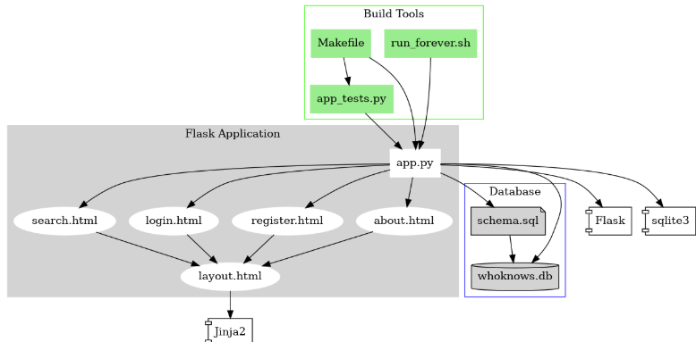

# Dependency Graph – WhoKnows Migration

## Hvad viser dependency grafen?

Grafen illustrerer arkitekturen i det legacy Flask-projekt, vi har migreret fra. Den er opdelt i tre overordnede lag:

**Build Tools** (grøn boks øverst) indeholder `Makefile`, `run_forever.sh` og `app_tests.py`, som alle peger ind mod `app.py`. De styrer henholdsvis opstart, process-management og test-kørsel.

**Flask Application** (grå boks) centrerer sig om `app.py`, som er den absolutte hub i arkitekturen. Herfra renderes fire HTML-templates (`search.html`, `login.html`, `register.html`, `about.html`), der alle nedarver fra `layout.html` via Jinja2-template-arv.

**Database** (blå boks) består af `schema.sql`, der definerer skemaet, og `whoknows.db`, som er den faktiske SQLite-database. Begge tilgås direkte fra `app.py`.

Eksternt trækker projektet på `Flask` og `sqlite3` som de to primære afhængigheder, samt `Jinja2` til templating.

---

## Hvordan brugte vi grafen til migrationen?

Dependency grafen gav os et klart overblik over, hvad der skulle migreres, og i hvilken rækkefølge.

**Først identificerede vi `app.py` som den centrale knude.** Da alle andre komponenter afhænger af den, startede vi her. Vi kortlagde dens routes og mappede dem direkte til Sinatra-routes i `app.rb`. `before`-blokken, der satte `g.user` i Flask, blev til en tilsvarende `before do`-blok i Sinatra, der sætter `@current_user` fra `session[:user_id]`.

**Dernæst håndterede vi databaselaget.** Vi erstattede Flasks direkte SQLite-kald med ActiveRecord via `sinatra-activerecord`. Det betød at usikker string formatting (`"WHERE id = '%s'" % id`) blev erstattet af ActiveRecords parameteriserede queries (`User.find_by(id: ...)` og `Page.where('content LIKE ?', ...)`). SQLite3 er fortsat databasen, nu via `sqlite3`-gem'met.

**Template-laget var næste skridt.** Vi erstattede Jinja2-templates med ERB. Strukturen er identisk – `layout.erb` fungerer som base-template med `<%= yield %>` i stedet for Jinja2's ``, og de fire views (`index.erb`, `login.erb`, `register.erb`, `weather.erb`) renderes direkte ind i den. Vi tilføjede desuden en ny `weather.erb`, som ikke eksisterede i Flask-projektet.

Et væsentligt arkitekturskift i templates er, at login- og register-formularer nu submitter via `fetch()` til API-endpoints (`/api/login`, `/api/register`) frem for direkte form-POST. Flash-beskeder håndteres derfor med `sessionStorage` og et toast-element i `layout.erb` frem for Flasks `flash()`-mekanisme.

**Sidst migrerede vi build-laget.** `Makefile` og `run_forever.sh` er erstattet af Rack (`rackup`) via Puma som server. Test-frameworket er skiftet fra Pythons `unittest` til RSpec med `rack-test` til HTTP-simulation. Under udvikling bruges Guard til at overvåge filændringer og genstarte serveren automatisk – svarende til Flasks debug-tilstand.

**Migrationsrækkefølgen** fulgte grafens pile – vi arbejdede fra blade (templates, schema) mod centrum (`app.py`/`app.rb`), så vi på intet tidspunkt migrerede en komponent, der afhang af noget, vi endnu ikke havde oversat.

